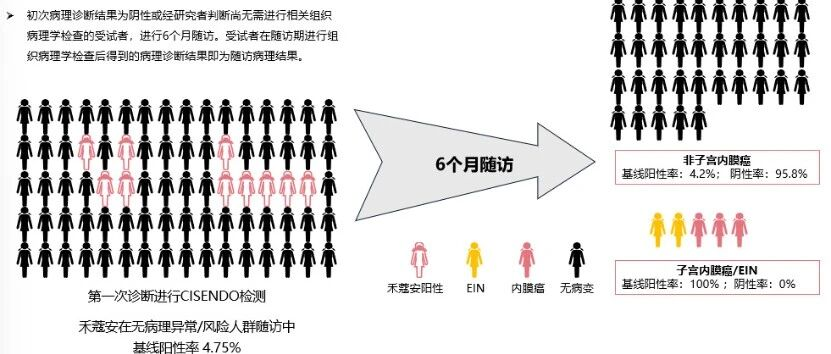

# 禾蔻安®临床解读（二）|如何破解内膜癌早筛难题？

_2025年12月24日 17:23_

面对子宫内膜癌早筛的临床困境，一项突破性技术应运而生。禾蔻安 ®(CDO1/CELF4) 基因甲基化检测试剂盒于 2024 年 12 月获国家药监局（NMPA）批准三类医疗器械注册证（国械注准 20243402610）。作为全球首个基于宫颈脱落细胞样本的无创子宫内膜癌早诊检测，它的上市造福许多女性并标志着子宫内膜癌早期筛查技术迈入了无创、便捷、精准的新阶段。

**一、多中心临床研究的坚实证据**

禾蔻安 ® 的性能已获得由北京协和医院牵头，联合上海红房子医院、中南大学湘雅三医院、浙江大学医学院附属妇产科医院等国内顶级妇瘤中心共同完成、入组 4818 例的大规模临床研究验证。其核心价值体现在：

- · 无创革命，采样便捷：仅需在常规妇科检查时同步采集宫颈脱落细胞（方式同 HPV 检测），无需宫腔操作，极大提升了受检意愿与筛查可及性。

- · 精准可靠，性能卓越：临床数据显示，其对子宫内膜癌的检测灵敏度高达 94.51%,特异性达 94.16%,能精准识别癌变风险。

- · 覆盖全面，预警前瞻：采用 CDO1 和 CELF4 双基因互补检测，可有效捕捉包括 I 型、II 型及罕见亚型在内的多种早期癌变“分子踪迹”。更值得注意的是，基线检测呈阳性的人群，在 6 个月内子宫内膜癌或癌前病变（EIN）的检出率高达 100%，展现了强大的前瞻性预警价值。

- · 弥补传统手段盲区：该检测可显著降低单纯影像学检查的潜在漏诊风险，并对超声提示的疑似病变进行无创的良恶性辅助鉴别。

图2：禾蔻安®精准检测不同类型早期内膜癌

图3：禾蔻安®具精准预警能力

**二、获权威指南认可，指引临床方向**

基于其优异的临床价值，子宫内膜癌甲基化检测技术已获国内权威共识推荐：

- ·《子宫内膜癌三级预防策略中国专家共识（2025 年版）》明确推荐将其用于联合筛查。

- ·《肿瘤 DNA 甲基化标志物检测及临床应用专家共识 (2024 版 )》明确了其临床应用场景。

禾蔻安 ® 临床数据显示对子宫内膜癌的检测灵敏度高达 94.51%,特异性达 94.16%，获得专家共识推荐能精准识别癌变风险。其适用于广泛的健康管理与风险筛查，特别推荐以下人群咨询评估：

1\. 存在异常症状者：尤其是有异常子宫出血（如绝经后出血、月经紊乱、经量过多或经期延长）的女性。

2\. 患有代谢性疾病者：如肥胖、糖尿病、高血压等患者，是内膜癌的高风险人群。

3\. 有特定病史或家族史者：包括多囊卵巢综合征（PCOS）患者、有子宫内膜癌或结直肠癌等家族史的女性，以及长期单独使用雌激素进行治疗者。

4\. 辅助诊断需求者：经阴道超声等影像学检查提示子宫内膜异常增厚或占位，或肿瘤标志物如 CA125 异常，需进行良恶性辅助鉴别者。

5\. 健康关注与主动管理者：希望采用高灵敏度、无创技术进行早期风险筛查的健康或高危女性。

**三、小结**

禾蔻安 ® 通过创新的无创基因检测技术，有效应对了传统筛查方法灵敏度不足、有创操作依从性低等核心痛点，为子宫内膜癌的早期发现提供了强有力的新工具。

建议符合上述高风险特征或关注自身生殖健康的女性，主动与您的医生沟通，了解禾蔻安 ® 检测的适用性。早期发现是战胜癌症的关键，主动筛查是守护健康的重要一步。

**参考文献**

[1] 中国妇幼健康研究会妇产科精准医疗专业委员会，上海市医学会妇科肿瘤学分会 . 子宫内膜癌三级预防策略中国专家共识（2025 年版）.中国实用妇科与产科杂志,2025,41(10)：1004-1011.

[2] 中国抗癌协会肿瘤标志专业委员会 . 肿瘤 DNA 甲基化标志物检测及临床应用专家共识 (2024 版 ) 中国癌症防治杂志 ,2024,16(2):129-142.

**关于聚禾生物**

北京起源聚禾生物科技有限公司是以创新科技为驱动、以关注健康为宗旨的科技企业。聚禾生物是妇科肿瘤早诊领域的开拓者，以独家技术和专利保护的标志物为核心，开发了宫颈癌、子宫内膜癌、卵巢癌等妇科肿瘤早诊产品，填补了该领域的空白。

随着女性对自身健康的关注越来越密切，女性健康市场将大有可为，除妇科肿瘤早筛早诊产品线外，未来聚禾生物还将建立更多女性健康相关的产品管线，打造女性健康市场的技术创新型领先企业。

