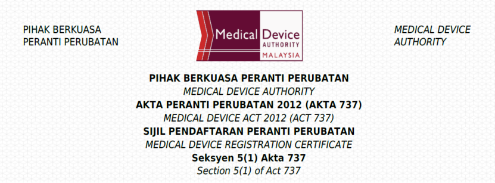

# 重磅喜讯！聚禾生物“禾蔻安®（CDO1/CELF4）®”成功获马来西亚注册证，国际化布局再进一步

_2025年12月25日 17:09_

聚禾生物自主研发的子宫内膜癌甲基化检测产品“禾蔻安 ®（CDO1/CELF4）”正式获得马来西亚医疗器械主管部门颁发的注册证书。此次获批标志着聚禾生物在妇科肿瘤精准诊断领域的国际化战略迈出关键一步，也为东南亚市场带来了创新、高效的子宫内膜癌早期筛查解决方案。

**一、深耕东南亚市场，精准诊断技术获国际认可**

马来西亚作为东南亚医疗市场的重要枢纽，对“禾蔻安 ®”成功获证，表明其技术可靠性、临床价值及质量管理体系均符合国际标准。子宫内膜癌是女性生殖系统常见恶性肿瘤之一，早期筛查对改善预后至关重要。此次“禾蔻安 ®”进入马来西亚市场,是公司践行“以技术守护女性健康”使命的重要实践，未来将逐步拓展至更多东南亚国家，为全球女性健康贡献”中国研发制造”智能。

**二、持续拓展海外布局，强化国际合作**

聚禾生物始终致力于通过创新分子诊断技术，推动妇科肿瘤的早筛早诊。继“禾蔻安 ®”之后，公司旗下子宫颈癌甲基化检测产品“禾宫康 ® ( PAX1/JAM3 )”及卵巢癌甲基化检测产品“禾薇益 ® ( CDO1/HOXA9 )”也有望陆续在海外获批，共同构建覆盖妇科高发肿瘤的完整早筛产品矩阵，为女性提供更全面、无创的早期风险评估工具。

此次“禾蔻安 ®”获证是公司践行“以技术守护女性健康”使命的重要实践，也为其进一步拓展东南亚乃至“一带一路”沿线市场奠定了坚实基础。未来，聚禾生物将继续深化与海外医疗机构、渠道伙伴的合作，通过技术创新与全球资源整合，推动中国精准诊断解决方案惠及更多地区女性，助力提升全球妇科肿瘤防控水平。

**关于聚禾生物**

北京起源聚禾生物科技有限公司是以创新科技为驱动、以关注健康为宗旨的科技企业。聚禾生物是妇科肿瘤早诊领域的开拓者，以独家技术和专利保护的标志物为核心，开发了宫颈癌、子宫内膜癌、卵巢癌等妇科肿瘤早诊产品，填补了该领域的空白。

随着女性对自身健康的关注越来越密切，女性健康市场将大有可为，除妇科肿瘤早筛早诊产品线外，未来聚禾生物还将建立更多女性健康相关的产品管线，打造女性健康市场的技术创新型领先企业。
