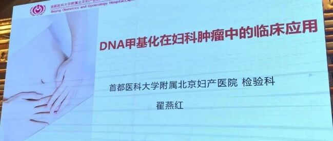

# 参会学习手记：北京妇幼检验新技术培训班聚焦DNA甲基化在妇瘤早诊落地实施

_2025年12月31日 17:13_

2025 年 12 月,由首都医科大学附属北京妇产医院与中国优生优育协会联合主办的“2025 年北京市妇幼检验新技术培训班暨第七届北京妇幼保健检验医学论坛”在北京成功召开。本届论坛汇聚了众多妇幼检验与临床医学专家，围绕前沿技术展开深度交流，共同推动学科发展。其中,DNA 甲基化检测技术在妇科肿瘤早期诊断中的临床转化与应用，成为会议关注的焦点。

首都医科大学附属北京妇产医院的翟燕红医生在题为《DNA 甲基化在妇科肿瘤中的应用》的专题报告中，系统阐述了该技术在妇科肿瘤诊疗中的关键作用与最新进展。她指出，通过 PAX1/JAM3 基因甲基化检测，能够有效辅助宫颈癌筛查。该技术不仅有助于缓解 HPV 阳性育龄女性的焦虑，更为绝经后女性在细胞学及阴道镜检查可能存在漏诊风险的情况下，提供了精准的分子病理学学解决方案。在子宫内膜癌的早期识别方面，CDO1/CELF4 甲基化检测与阴道超声联合应用，可对符合特定影像学标准（绝经后 ≥ 5mm,绝经前 ≥ 11mm）的子宫内膜情况进行有效内膜癌高风险鉴别，辅助区分子宫内膜癌高风险与良性病变，为临床判断是否需行宫腔镜检查提供了重要的分子病理证据，从而推动更精准的诊疗决策，减少不必要的侵入性操作与潜在漏诊，实现了无创检测的临床应用突破。

北京清华长庚医院刘禹利博士发表了《卵巢癌甲基化在妇科中的应用》专题报告，重点介绍了国内首个获批的卵巢癌甲基化检测试剂盒的临床应用价值。卵巢癌早期症状隐匿，诊断时多为晚期，临床称之为“沉默的杀手”。刘禹利博士指出,CDO1/HOXA9 甲基化检测能够从血液中无创捕捉肿瘤释放的早期分子信号。该检测与腹部超声联合，可对影像卵巢癌不典型的病例实现高达 92% 的检出率，显著降低漏诊﹔对超声典型患者提供卵巢癌高风险分子病理证据，医师可以针对卵巢癌高风险患者进行更仔细检查与及时治疗｡与 CA125 肿瘤标志物联用，可在 CA125 阳性时辅助鉴别卵巢癌与其他疾病，减少不必要的检查与患者焦虑；对于 CA125 阴性但伴有相关症状的患者，仍可精准识别 93% 的早期卵巢癌，避免因反复检查而延误诊断。这一技术为卵巢癌的早期预警与精准筛查开辟了革命性的新途径。

本届论坛通过高水平的学术对话，充分展现了 DNA 甲基化检测从科研走向临床的坚实步伐。随着此类突破性技术不断在临床实践中落地与优化，预计将为妇科肿瘤的早期发现、精准诊断与个性化治疗带来深刻变革，为提升女性健康水平注入重要的科技动力。

**关于聚禾生物**

北京起源聚禾生物科技有限公司是以创新科技为驱动、以关注健康为宗旨的科技企业。聚禾生物是妇科肿瘤早诊领域的开拓者，以独家技术和专利保护的标志物为核心，开发了宫颈癌、子宫内膜癌、卵巢癌等妇科肿瘤早诊产品，填补了该领域的空白。

随着女性对自身健康的关注越来越密切，女性健康市场将大有可为，除妇科肿瘤早筛早诊产品线外，未来聚禾生物还将建立更多女性健康相关的产品管线，打造女性健康市场的技术创新型领先企业。
