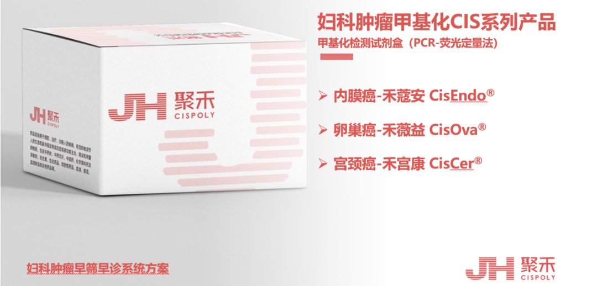

# 禾宫康®临床解读（二）| 一次检测的安心指南：清晰的宮頸“风险地图”

_2026年01月16日 17:06_

当 HPV 检测或 TCT（宫颈刮片）结果显示异常时，很多女性朋友都会感到困惑与不安：“我到底有没有事？接下来该怎么办？”

禾宫康 ®(PAX1/JAM3) 基因甲基化检测，经过国内大医院临床试验和中国国家药品监督管理局（NMPA）认证，为您提供更清晰、更准确答案的新型宫颈癌检测工具。简单来说，它就像一份细胞内部的“风险报告”，能帮助您在面对不确定的筛查结果时，或有生理症状得不到检查答案时，更精准地评估当前宫颈高级别病变情况，实现更安心的健康管理。

**一、何时应考虑进行检测？**

**在以下几种常见情况下，禾宫康 ® 甲基化检测能为您提供关键的决策信息：**

- · 当 HPV 检查结果为阳性时，尤其是非 16/18 型阳性，它能帮助明确是“一过性感染”还是存在“进展风险”，从而判断是否需要立即进行阴道镜检查。

- · 当宫颈刮片（TCT）结果不明确时，例如报告为 ASC-US（意义不明的非典型鳞状细胞）或 LSIL（低度鳞状上皮内病变），它能提供额外的分子证据，辅助判断病变风险。

- · 当您有担忧或症状，但常规检查未能给出明确解释时，它可以作为一种更深入的分子层面的探查。

- · 对于宫颈高级别病变治疗后的定期随访,它比传统方法能更早、更特异性地监测复发风险。

- · 对自己健康关注或一年以上未进行宫颈癌筛查女性。

**二、检测体验：与常规筛查同样简单、无创**

· 取样过程您很熟悉：检测的取样方式，与您已经做过的 HPV 或 TCT 检查完全相同。医生只需用一个小刷子在宫颈口轻轻刷取一些自然脱落的细胞。整个过程快速、无创，没有额外的痛苦或不适。

· 一份样本，多重信息：这项检测非常便捷,通常可以同一次取样，一起完成 HPV、TCT 和禾宫康 ® 甲基化检测。这意味着，一次简单的检查，就能从“有无病毒感染”、“细胞形态有无异常”和“细胞内部有无向病变发展的基因变化”三个层面，为您提供更全面的评估。

**三、结果解读：获得清晰明确的行进方向**

收到报告后，理解结果的含义至关重要。甲基化检测的结果主要分为两类，它们为您指出了截然不同的、清晰的后续路径：

1\. 如果结果为“甲基化阴性”：这意味着当前风险很低，可以安心随访

- · 结果含义：这表明，在您当前的宫颈细胞中，没有检测到与高级别癌前病变（CIN2+）相关的明确分子标志。即使 HPV 检测呈阳性，这个结果也强烈提示，您当前存在可进展性病变的风险非常低。

- · 您该怎么做：这通常是一个令人安心的信号。它帮助您和医生判断，您属于可以安心定期复查的低风险人群。您只需遵照医嘱，在未来定期（例如 1 年）进行常规筛查即可，从而能有效避免因焦虑而接受不必要的阴道镜检查或过度治疗，大大减轻了心理和医疗负担。

2\. 如果结果为“甲基化阳性”：这意味着抓住了一次关键的早期干预时机

- · 结果含义：这表明您的宫颈细胞中出现了与癌前病变相关的稳定分子标记。请您理解，这绝对不等于确诊癌症，而是一个重要的预警信号，提示细胞内部可能正在发生不良变化，需要也值得通过阴道镜检查来明确具体情况。

- · 您该怎么做：医生通常会建议您进行阴道镜检查（必要时进行活检）。这是诊断宫颈病变的“金标准”，可以在直视下观察宫颈，并在最可疑的部位取少许组织进行病理分析，从而明确与分子变化对应的实际病变程度。

- · 积极看待：请认识到，这恰恰是宫颈癌防治链条中最可干预、最有效的一环。绝大多数的癌前病变完全可以通过无微创干预 ( 例如光动力等 ) 或是激光、LEEP 刀等简单的门诊小手术得到根治性治疗，成功阻断其向癌症发展的路径，并且能很好地保留子宫和生育功能。及时发现它，正是为了用最小的代价、最精准地解决它。

**四、小结**

禾宫康 ® 甲基化检测，就像一台洞察先机的“分子探针”，在细胞的形态还未明显改变前，探查其内在的基因活动状态。它能在您因 HPV 阳性、TCT 异常或身体有症状但常规检查无明确结论而感到迷茫时，提供一份更清晰的个人“风险地图”，让后续的决策——无论是安心随访，还是积极干预——都更加有据可依、方向明确。与您的医生充分沟通这项检测结果，是您主动、科学管理自身宫颈健康的重要一步。

**关于聚禾生物**

北京起源聚禾生物科技有限公司是以创新科技为驱动、以关注健康为宗旨的科技企业。聚禾生物是妇科肿瘤早诊领域的开拓者，以独家技术和专利保护的标志物为核心，开发了宫颈癌、子宫内膜癌、卵巢癌等妇科肿瘤早诊产品，填补了该领域的空白。

随着女性对自身健康的关注越来越密切，女性健康市场将大有可为，除妇科肿瘤早筛早诊产品线外，未来聚禾生物还将建立更多女性健康相关的产品管线，打造女性健康市场的技术创新型领先企业。
