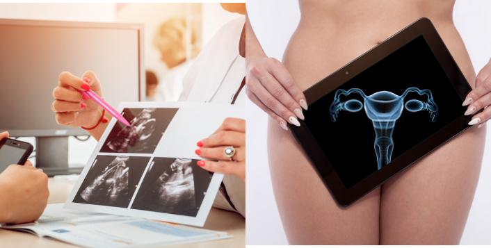

# 体检篇(二) | 妇瘤双筛报告，三步轻松看懂

_2026年01月29日 16:42_

做完“妇瘤双筛”检查－子宫内膜癌(禾蔻安®：CDO1/CELF4)与宫颈癌(禾宫康®：PAX1/JAM3)甲基化检测，看懂报告是健康管理的第一步。请记住，这是一份“健康风险提示”,旨在为您指明后续的健康管理方向，而非最终诊断。

在 [[2026-01-19-1659]体检篇一守护女性健康从一次妇瘤双筛开始为体检加一份双保障 | 体检篇(一) |守护女性健康，从一次妇瘤双筛开始—为体检加一份双保障]] 中，我们的妇瘤双筛可以为您的体检加一份双保障。

您的子宫内膜癌(禾蔻安®：CDO1/CELF4)与宫颈癌(禾宫康®：PAX1/JAM3)甲基化检测报告通常显示以下三种情况，每种都有清晰的行动指南：

**情况一：双阴性（两项指标均为低风险）**

- 报告在说：目前检测显示,您罹患宫颈和子宫内膜高级别病变 ( 癌 ) 的风险较低。
- 我该怎么做：这是一个令人安心的基因风险结果。请保持健康生活方式，并遵医嘱定期复查。请注意：即使本结果双阴,如果您有 HPV 感染、异常症状（如异常出血）或其他妇科疾病, 仍需及时就医诊治，这与癌症筛查是两件事。

**情况二：单阳性（其中一项为高风险）**

- 报告在说：这提示您的宫颈或子宫内膜有一项需要进一步关注。

- 我该怎么做：

	- 若报告为“宫颈癌高风险（PAX1/JAM3阳性）”：请预约妇科或宫颈门诊。医生会结合您的 HPV 史、TCT（细胞学）结果、症状等综合判断，可能会建议进行阴道镜检查，以便更清晰评估宫颈状况。就诊时，可提醒医生注意检查宫颈管等隐匿部位, 如尚无发现须立即有创治疗病变时, 可与医生讨论自身生育或其他考虑因素等需求, 进行无微创 ( 激光等 ) 治疗或 / 和定期复查 (3-6 月 ) 方案。
	
	- 若报告为“子宫内膜癌高风险（CDO1/CELF4阳性）”：请预约妇科。医生通常会先安排经阴道超声检查，查看子宫内膜情况，再结合您的症状、家族史、其他风险因素等，判断是否需要宫腔镜检查或制定定期复查 (3-6 月 ) 计划。
	
	- 为何说定期复查：因为甲基化是早期风险指标。若医院检查暂未发现需立即处理的病变，这正是一个重要的健康预警，提示您需要调整生活方式、更加关注自身健康，并遵医嘱定期复查 (3-6 月 ) 甲基化及进行其他必要检查。

**情况三：双阳性（两项 PAX1/JAM3和 CDO1/CELF4两项均为高风险）**

- · 报告在说：这提示您的宫颈和子宫内膜均需高度重视。由于解剖位置相近，两者可能需要**分别评估**。

- · 我该怎么做：请携带报告前往医院妇科就诊。医生会为您系统安排检查（可能从宫颈到内膜逐一排查），分别明确两处状况，并制定后续的诊疗或 /和定期复查 (3-6 月 ) 方案。

- · 为何说定期复查：因为甲基化是早期风险指标。若医院检查暂未发现需立即处理的病变，这正是一个重要的健康预警，提示您需要调整生活方式、更加关注自身健康，并遵医嘱定期复查甲基化及进行其他必要检查。

**核心建议**

无论结果如何，请保持镇定与积极。筛查的目的正是“早发现、早干预”。一个阳性结果，恰恰说明检查发挥了关键的预警作用，引导您在问题萌芽期就采取行动，这是关爱自己、主动管理健康的最佳时机。请务必咨询专业医生，获取针对您个人情况的最合适指导。

从一次高效的前沿筛查开始，主动管理健康，从容拥抱未来。

**关于聚禾生物**

北京起源聚禾生物科技有限公司是以创新科技为驱动、以关注健康为宗旨的科技企业。聚禾生物是妇科肿瘤早诊领域的开拓者，以独家技术和专利保护的标志物为核心，开发了宫颈癌、子宫内膜癌、卵巢癌等妇科肿瘤早诊产品，填补了该领域的空白。

随着女性对自身健康的关注越来越密切，女性健康市场将大有可为，除妇科肿瘤早筛早诊产品线外，未来聚禾生物还将建立更多女性健康相关的产品管线，打造女性健康市场的技术创新型领先企业。
