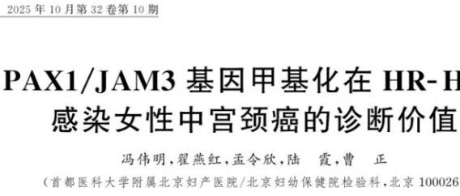
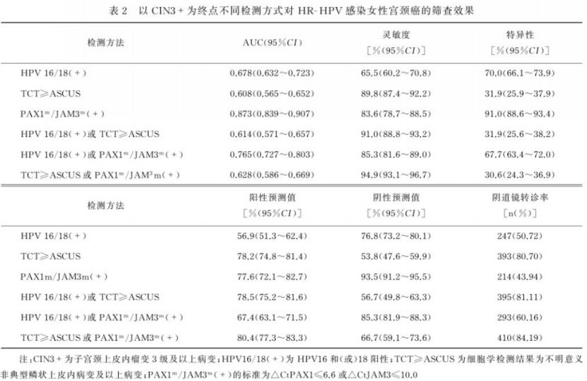
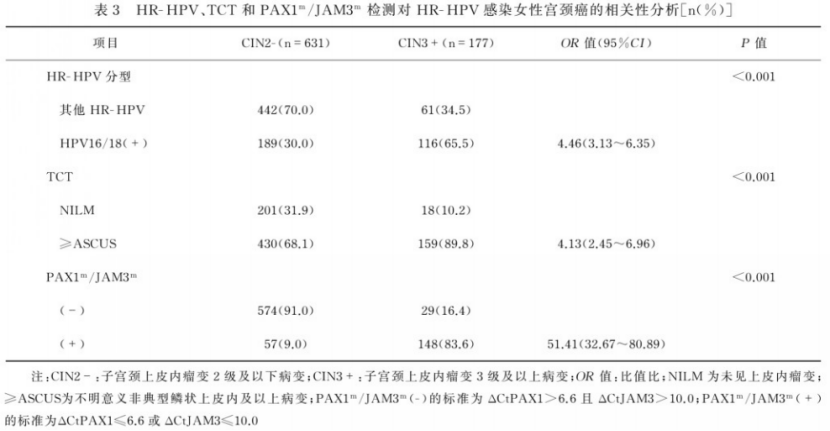

# 新文刊发| 禾宫康® CISCER®—无创双基因检测让宫颈癌筛查更精准

_2026年02月02日 16:59_

近日,一项由首都医科大学附属北京妇产医院团队表于《标记免疫分析与临床》的一项重要研究探索了一种基于 PAX1 和 JAM3 双基因甲基化检测（商品名：禾宫康 ® CISCER®）的新方法。

这项研究发现禾宫康 ® CISCER® 检测在 HR-HPV 感染女性宫颈癌中的诊断效能显著优于传统的 HPV16/18 和 TCT 检测,可提升宫颈癌筛查的精准度, 减少不必要的侵入性检查,有望成为我国宫颈癌筛查的新型分子标志物。

**一、研究背景与方法**

宫颈癌是威胁全球女性健康的主要恶性肿瘤之一，高危型 HPV（high-risk HPV, HR-HPV）感染是其主要诱因。目前，临床床上广泛使用的细胞学检查和 HR-HPV 检测方法,可能会导致较高的阴道镜转诊率和复杂的分流管理。针对这一问题，专家建议优化筛查方法。

这项研究共纳入 808 例高危 HPV 感染女性，同时进行 HPV 分型、TCT 及 PAX1/JAM3 甲基化检测，并以组织病理学结果为金标准，系统评估了三种检测方法的诊断效能。

**二、关键研究结果**

研究发现,PAX1/JAM3 双基因甲基化检测在识别宫颈癌前病变（尤其是 CIN3 及以上）方面表现突出：

- 诊断准确率高：对宫颈癌的灵敏度达 86.3%,特异度达 91.0%,综合诊断能力显著优于传统方法。

- 转诊率显著降低：该检测的阴道镜转诊率仅为 43.94%,比 HPV16/18 检测降低 6.78%,比 TCT 降低 36.76%。

风险预警能力强：PAX1/JAM3 阳性患者发展为宫颈癌的风险是阴性患者的 51.41 倍，显示出强大的风险分层能力。

**三、临床意义**

该检测方法的推广将带来以下临床益处：

- 精准分流：能更准确识别真正需要阴道镜检查的高风险人群，避免对低风险人群的过度医疗。

- 节约医疗资源：减少不必要的阴道镜检查和活检，缓解医疗系统压力。

- 提升筛查体验：降低女性因筛查结果异常带来的心理负担与不必要的侵入性检查。

**四、研究意义**

本研究为宫颈癌筛查提供了一种基于表观遗传标志物的新策略，标志着筛查模式从“病原检测”向“宿主基因状态检测”的转变。该检测方法已在中国部分医院开展应用，为未来将其纳入国内外宫颈癌筛查指南提供了重要证据。

**五、结论**

PAX1/JAM3 双基因甲基化检测在高危 HPV 感染女性中表现出优异的诊断性能与分流价值，有望成为宫颈癌精准筛查与分层管理的新工具。未来，需进一步开展多中心、大样本研究，推动该技术在全球范围内的临床应用。

**参考文献：**

冯伟明 , 翟燕红 , 孟令欣 , 陆霞 , 曹正 .PAX1/JAM3 基因甲基化在 HR-HPV 感染女性中宫颈癌的诊断价值 [J]. 标记免疫分析与临床 ,2025,32(10):2027-20322133 . DOI:
10.11748/bjmy.issn.1006-1703.2025.10.008

**关于聚禾生物**

北京起源聚禾生物科技有限公司是以创新科技为驱动、以关注健康为宗旨的科技企业。聚禾生物是妇科肿瘤早诊领域的开拓者，以独家技术和专利保护的标志物为核心，开发了宫颈癌、子宫内膜癌、卵巢癌等妇科肿瘤早诊产品，填补了该领域的空白。

随着女性对自身健康的关注越来越密切，女性健康市场将大有可为，除妇科肿瘤早筛早诊产品线外，未来聚禾生物还将建立更多女性健康相关的产品管线，打造女性健康市场的技术创新型领先企业。
