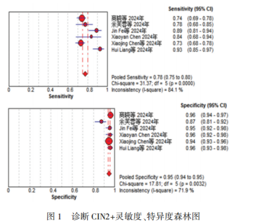
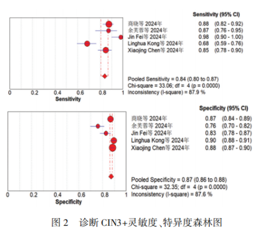

# 新文刊发 | 首篇PAX1/JAM3甲基化Mata分析—说明宫颈癌筛查精准检测高效能

_2026年02月05日 14:37_

近日，一项由昆明医科大学附属延安医院团队发表于《现代妇产科学》的 Meta 分析研究指出,对宫颈脱落细胞进行 PAX1/JAM3 基因甲基化检测（商品名：禾宫康 ® CISCER®）,可显著提升对高级别癌前病变（HSIL）的诊断准确性, 这为宫颈癌筛查与分层管理提供了新方向。

**一、研究概况**

宫颈癌是威胁全球女性健康的主要恶性肿瘤之一，早期发现癌前病变并精准干预，是降低其发病与死亡的关键。当前常用的宫颈癌筛查方法，如 HPV 检测和细胞学检查，虽已广泛应用，但单一检测方法往往难以获得可靠的诊断结果, 且仍存在“过度转诊”和“漏诊”的问题。

**二、研究方法**

该诊断性 Meta 分析由昆明医科大学附属延安医院团队完成，系统检索中英文数据库（如 CNKI、PubMed、Embase 等），整合了截至 2024 年 2 月的 7 项临床研究数据。使用 QUADAS-2 工具进行文献质量评估。采用 Meta-Disc
1.4 和 Stata 软件进行异质性检验、效应量合并（灵敏度、特异度、AUC 等）、敏感性分析和发表偏倚检验，评估了 PAX1 与
JAM3 双基因甲基化检测在诊断宫颈高级别鳞状上皮内瘤变（HSIL,包括 CIN2+ 和 CIN3+）中的诊断效能，为其在宫颈癌筛查与分流管理中的临床应用提供循证依据。

**三、主要结果**

研究显示,PAX1 与 JAM3 双基因甲基化检测表现出优异的诊断性能：

对于中重度病变（CIN2+），检测的灵敏度为 78%,特异度高达 95%,综合诊断准确性曲线下面积（AUC）达到 0.969，属于极高准确性水平。

对于更严重的病变（CIN3+），灵敏度提升至 84%,特异度为 87%, AUC 为 0.925,同样显示出强大的识别能力。

这些数据意味着，该检测方法能有效区分高危病变与正常或低危状态，尤其在减少“假阳性”方面表现突出，适用于宫颈癌筛查中的高危人群分流, 有助于避免不必要的进一步检查。

**四、临床意义**

该检测方法的推广，有望在以下几个方面改善现有宫颈癌筛查体系：

精准分流：对 HPV 阳性人群，可通过甲基化检测筛选出真正高风险个体，减少不必要的阴道镜检查，缓解医疗压力。

提升筛查效率：高特异度意味着更少的误诊，有助于将医疗资源集中于真正需要干预的人群。

支持自采样筛查：部分研究提示该检测也可用于女性自采样本，有助于提升筛查覆盖率和可及性，尤其适用于医疗资源不足地区。

**五、研究意义**

本研究不仅为 PAX1/JAM3 双基因甲基化检测提供了迄今为止最全面的证据支持，也为宫颈癌筛查从“病原检测”迈向“宿主基因状态检测”提供了重要参考。该技术已被中国部分医院用于临床辅助诊断，但其纳入国际指南仍需更多跨种族、大样本的前瞻性研究验证。

未来，随着该检测技术的进一步优化与普及，宫颈癌筛查有望实现更个体化、更精准的管理模式，推动全球宫颈癌防控向“早发现、早干预、精准治疗”的目标迈进。

**参考文献：**

肖金芬 , 张旭梅 , 刘懿 , 丁尚玮 , 曾倩 , 李芹 . PAX1、JAM3 甲基化对子宫颈高级别上皮内瘤变诊断的 meta 分析 [J]. 现代妇产科进展 ,2025,34(9):680-684690 . DOI：
10.13283/j.cnki.xdfckjz.2025.09.004

**关于聚禾生物**

北京起源聚禾生物科技有限公司是以创新科技为驱动、以关注健康为宗旨的科技企业。聚禾生物是妇科肿瘤早诊领域的开拓者，以独家技术和专利保护的标志物为核心，开发了宫颈癌、子宫内膜癌、卵巢癌等妇科肿瘤早诊产品，填补了该领域的空白。

随着女性对自身健康的关注越来越密切，女性健康市场将大有可为，除妇科肿瘤早筛早诊产品线外，未来聚禾生物还将建立更多女性健康相关的产品管线，打造女性健康市场的技术创新型领先企业。
