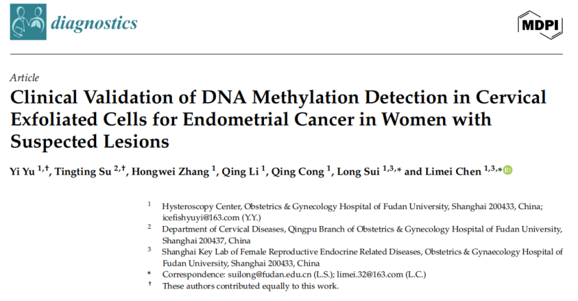

# 新文刊发| CDO1/CELF4 双基因检测在拟行宫腔镜患者中显示高度诊断效能

_2026年02月09日 17:03_

一项来自复旦大学附属妇产科医院发表于国际期刊《Diagnostics》的大规模前瞻性研究显示，通过检测宫颈脱落细胞中 CDO1 与 CELF4 两基因的甲基化状态，可以高灵敏、高特异地识别子宫内膜癌（EC）与其前驱病变（EIN）。该非侵入性检测在 2164 名拟行宫镜 / 宫腔手术的疑似病例中表现出 >93% 的灵敏度与 ~96.7% 的特异度，与经阴道超声（TVS）联合使用时，敏感度和阴性预测值进一步提高，提示它可作为临床上有价值的分流工具，减少不必要的侵入性检查。

**一、研究背景与方法**

子宫内膜癌在全球范围内发病率逐年上升，早期诊断直接关系到预后与治疗范围。但目前确诊往往仍依赖宫腔镜、刮宫等侵入性操作，缺乏既简便又可靠的非侵入性筛查手段。

研究团队基于表观遗传学原理，选取在 EC 中被发现高频甲基化并可能被沉默的抑癌基因 CDO1 与 CELF4,在拟做宫腔镜手术的 2164 名患者术前采集宫颈脱落细胞样本,用禾宫康 ®（CISCER®）试剂盒来检测 PAX1/JAM3 基因的甲基化状态，并以宫腔镜 \+ 病理结果为金标准评估检测性能。该研究中，阳性 TVS 结果被定义为绝经前女性子宫内膜厚度 >11 毫米，绝经后女性为 >5 毫米，或存在腔内肿块或子宫内膜超声不规则。所有检测均在盲法条件下完成，且部分样本送第三方用 Sanger 测序复核以保证方法学准确性。

**二、关键研究结果**

总体表现：CDO1/CELF4 联合阳性对 EC 的检出灵敏度为 93.94%,特异度 96.7%, NPV 高达 99.90%，这意味着当检测为阴性时，几乎可以排除存在 EC 的可能性（在本研究人群中）。

与 TVS 联合：在本队列中，若将 TVS 与甲基化检测采取有任意指标呈现阳性即联合指标视为阳性的规则,联合指标对 EC 的敏感度与 NPV 达到 100%,对临床排除高危病例具有价值。

EIN 检测：联合检测对 EIN 的敏感度亦高（约 83.9%），特异度接近 98%,提示该方法对早期病变也具备良好识别能力。

方法学可靠性：试剂与流程与第三方 Sanger 测序比对一致率极高（Kappa ≈0.99），说明检测方法准确且可重复。

**三、临床意义**

非侵入性分流工具：对出现异常子宫出血或经 TVS 检查提示可疑内膜病变的患者，使用宫颈脱落细胞甲基化检测可在术前更准确地识别出高危个体，从而优先安排进一步的宫腔镜 /病理学诊断，或对低风险者避免直接行侵入性检查。

提高早期（包括 Type II）病变检出：研究显示对 II 型 EC（临床表现不典型）检测敏感度仍高，提示甲基化标志物对于那些超声不显著但分子变化明显的亚型具有重要价值。

在资源有限环境的应用潜力：结合 TVS 的分层策略有助于优化医疗资源分配，尤其在高流量或基层机构，可用来决定哪些患者需要优先转诊或进一步侵入性检查。

**四、研究意义与方法学启示**

本研究证明了宫颈脱落细胞作为检测内膜病变表观遗传信号的可行来源，支持“子宫 \- 宫颈微环境液体活检”在妇科肿瘤早筛中的应用。

与早前提出的多基因甲基化面板相比，本研究用双基因策略在大样本人群中实现了更高的特异度，提示“少而精”的基因组合在临床转化上具有现实优势。

**五、结论**

这项基于 2164 例拟行宫腔镜患者的前瞻性研究表明，宫颈脱落细胞中 CDO1/CELF4 双基因甲基化检测具有高灵敏度与高特异度，且与经阴道超声联合使用时可实现更高的检出率与排除能力，为临床上对疑似内膜病变患者提供了一种安全、便捷的非侵入性分流手段。未来通过多中心与更广泛人群的外部验证，并结合现有在宫颈筛查中表现良好的 PAX1/JAM3 等甲基化标志物的研究进展，有望推动表观遗传学检测在妇科肿瘤早筛与精准分层中的临床转化。

**参考文献：**

Yu Y, Su T, Zhang H, Li Q, Cong Q, Sui L, Chen L. Clinical Validation of DNA Methylation Detection in Cervical Exfoliated Cells for Endometrial Cancer in Women with Suspected Lesions. Diagnostics (Basel). 2026 Jan 6;16(2):174. doi:
10.3390/diagnostics16020174 . PMID: 41594150; PMCID: PMC12840197.

**关于聚禾生物**

北京起源聚禾生物科技有限公司是以创新科技为驱动、以关注健康为宗旨的科技企业。聚禾生物是妇科肿瘤早诊领域的开拓者，以独家技术和专利保护的标志物为核心，开发了宫颈癌、子宫内膜癌、卵巢癌等妇科肿瘤早诊产品，填补了该领域的空白。

随着女性对自身健康的关注越来越密切，女性健康市场将大有可为，除妇科肿瘤早筛早诊产品线外，未来聚禾生物还将建立更多女性健康相关的产品管线，打造女性健康市场的技术创新型领先企业。
