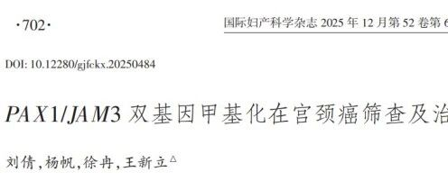

# 新文刊发| PAX1/JAM3双基因甲基化提升现行宫颈癌筛查精准度

_2026年02月12日 13:21_ 宁夏

针对宫颈癌筛查的瓶颈问题，一篇由来自山东第一医科大学团队撰写，发表于《国际妇产科学杂志》（2025 年）,题为《PAX1/JAM3 双基因甲基化在宫颈癌筛查及治疗中的应用》的综述系统回顾并整合了近年来关于该双基因甲基化检测的临床与机制研究成果。研究人员提出并总结了 PAX1 与 JAM3 双基因甲基化作为客观分子标志物在筛查、分流与潜在治疗中的应用价值与挑战，为临床实践与后续研究提供了重要参考。

**一、要点速览**

- PAX1 与 JAM3 两项基因的启动子区甲基化水平与宫颈上皮病变严重程度呈正相关，单独或联合检测在识别 CIN2+/CIN3+ 方面显示出优于传统细胞学（TCT）或仅依赖 HPV 检测的诊断性能。

- 在多中心研究中,PAX1/JAM3 联合检测诊断 CIN2+ 的敏感度与特异度分别约为 74.1% 与 95.9%；诊断 CIN3+ 的敏感度与特异度分别约为 87.6% 与 86.8%,总体 AUC = 0.872,显著优于单独 TCT 或 HPV 检测。

- PAX1 具有肿瘤抑制功能，其甲基化沉默与肿瘤进展及化疗 / 放疗反应相关；体外研究显示通过表观遗传编辑逆转 PAX1 甲基化可以显著提高顺铂敏感性。JAM3 在筛查中表现出较高特异度，同时其在肿瘤转移过程中的作用机制（例如通过 HIF-1α/VEGFA 途径）也在研究中被揭示。

**二、背景与临床意义**

尽管 HPV DNA 检测和细胞学检查（TCT）是当前筛查主力，但前者特异度有限、易导致过度诊疗，后者受判读主观性影响且敏感度不高。随着 DNA 甲基化检测技术成熟，表观遗传标志物成为可行的“二次分流”策略：在 HPV 阳性或细胞学异常的队列中，借助甲基化结果更合理地决定是否转诊阴道镜或直接治疗，从而减少不必要的侵入性检查与医疗资源浪费。PAX1/JAM3 联合检测在这方面展现出平衡高敏感度与高特异度的潜力。

**三、机制与证据亮点**

- PAX1：作为一类配对框转录因子,PAX1 在宫颈癌中常表现为高甲基化 / 低表达状态，导致其抑癌功能丧失。功能研究提示 PAX1 影响 WNT/TIMELESS 等信号通路，且去甲基化或过表达可恢复化疗敏感性。
- JAM3：属于连接黏附分子家族，在免疫细胞跨内皮迁移与细胞黏附上有重要功能。临床数据表明 JAM3 在部分宫颈癌分子亚型（尤其与腺癌相关的样本）中甲基化或表达水平与病期、淋巴结转移相关，其在促进转移方面可能通过 HIF-1α/VEGFA 通路发挥作用。

**四、应用场景与优势**

- 临床分流：对 HPV16/18 阳性或 HPV 阳性但细胞学不明确的女性,PAX1/JAM3 联合检测可将高危患者更准确地筛出，减少低危人群的阴道镜转诊率。

- 自采样可行性：部分研究显示女性自采样本用于 PAX1/JAM3 检测在识别 CIN2+/CIN3+ 上具有良好一致性，提示在扩大筛查覆盖面、提高可及性方面具有潜力（尤其适用于偏远或资源受限地区）。

- 治疗指导：PAX1 甲基化状态可能为化疗 / 放疗敏感性预测提供分子依据，未来有望用于个体化治疗决策。

**五、研究展望与建议**

- 发起大规模、多中心、前瞻性临床验证试验，覆盖不同地区与人群，以评估 PAX1/JAM3 策略的普适性与长期结局效用。

- 评估在不同筛查算法（仅 HPV、HPV ＋甲基化、TCT ＋甲基化等）下的成本效益与临床路径优化，尤其关注在低 /中等资源地区的可行性。

- 深入阐明 JAM3 在宫颈腺癌与鳞癌中不同的生物学角色及其与免疫微环境的互作，探索其作为治疗靶点的可行性。

**六、结语**

PAX1/JAM3 双基因甲基化作为一种兼具敏感度与特异度的分子标志物，正在从研究走向临床转化的道路上展现出希望。该综述为临床筛查策略优化、分流决策与分子化个体化治疗的设计提供了理论依据，但要实现广泛临床应用，仍需更多质量更高、覆盖更广的循证研究与统一的技术规范。

**参考文献：**

刘倩 , 杨帆 , 徐冉 , 王新立 .PAX1/JAM3 双基因甲基化在宫颈癌筛查及治疗中的应用 [J]. 国际妇产科学杂志 ,2025,52(6):702-707.DOI:10.12280/gjfckx.20250484 .

**关于聚禾生物**

北京起源聚禾生物科技有限公司是以创新科技为驱动、以关注健康为宗旨的科技企业。聚禾生物是妇科肿瘤早诊领域的开拓者，以独家技术和专利保护的标志物为核心，开发了宫颈癌、子宫内膜癌、卵巢癌等妇科肿瘤早诊产品，填补了该领域的空白。

随着女性对自身健康的关注越来越密切，女性健康市场将大有可为，除妇科肿瘤早筛早诊产品线外，未来聚禾生物还将建立更多女性健康相关的产品管线，打造女性健康市场的技术创新型领先企业。
