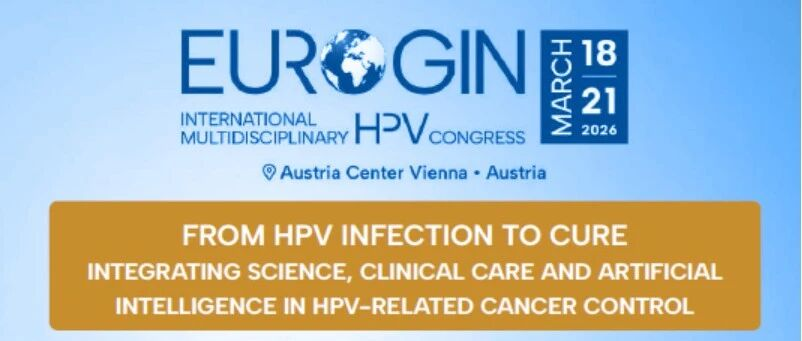
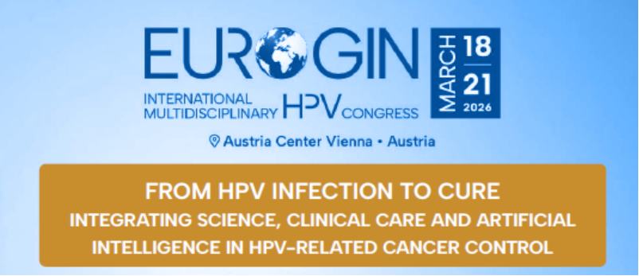

# Eurogin2026大会聚焦DNA甲基化：革新妇科癌症筛查与风险分层

_2026年03月25日 16:00_

3 月 18-21 日，在奥地利维也纳举行的第 33 届 Eurogin 国际大会上，多位专家展示了 DNA 甲基化技术在前沿筛查、风险分层的突破性进展，预示着这一非侵入性工具将重塑宫颈癌等妇科癌症的临床实践。

**一、中国在甲基化检测领先全球**

中国团队在宫颈癌甲基化筛查技术领域实现全球领先，自主研发的 PAX1/JAM3 基因甲基化检测方案为解决全球宫颈癌防治难题提供了创新路径。这项突破性 PAX1/JAM3 技术通过大规模多中心临床试验验证，展现出显著优势：对高级别宫颈病变（CIN2+）检测灵敏度达 89.2%、特异性92.7%,显著优于现有筛查方法。该技术最大创新在于能精准识别真正具有癌变风险的 HPV 持续感染，将不必要的阴道镜转诊率降低 40%
以上，极大优化了医疗资源配置。

**" 中国方案 "** 的核心突破体现在三大创新：一是检测标志物创新，首次发现 PAX1/JAM3 甲基化是宫颈病变早期关键分子事件，较传统方法能更早识别癌变风险；二是检测维度创新，对宫颈腺癌和鳞癌的检出率分别达到 91.5% 和 93.2%，成功解决了现有方法对腺癌检出不足的临床痛点；三是服务模式创新，结合自取样技术突破时空限制，使偏远地区女性也能获得高质量筛查服务。这一方案不仅为我国宫颈癌防治工作提供技术支撑，更为发展中国家探索出可复制、可推广的防控新模式。

**二、欧盟制定宫颈癌甲基化指南**

法国研究员 Ramirez Pineda Arianis Tatiana 的报告显示，欧洲癌症委员会目前正致力基于循证医学证据，系统推进宫颈癌筛查指南的更新工作，将甲基化检测正式纳入 HPV 阳性分流管理的临床路径。旨在通过优化筛查策略降低宫颈癌疾病负担。

该指南更新的核心目标在于应对当前 HPV 初筛方法高敏感性但低特异性所带来的临床挑战，从而实现对 HPV 阳性女性的精准化管理，减少不必要的阴道镜检查与过度治疗。此举标志着欧洲在推动宫颈癌筛查向标准化、精准化方向迈进的关键进展，甲基化检测作为新一代分子标志物检测技术，正在被纳入欧洲筛查体系的新规范之中，体现了其筛查指南现代化与临床路径规范化的发展方向。

**三、精准风险分层：指导临床决策关键**

斯洛文尼亚专家 Dovnik Andraz 在“甲基化检测在 CIN、外阴或肛门病变管理中的应用”环节指出，甲基化分析能有效区分宫颈上皮内瘤变（CIN）的进展风险。通过对高危 HPV 阳性患者进行甲基化分型，可精准识别需立即干预的高危人群（如 CIN3+），避免对一过性感染者的过度治疗。数据显示，甲基化阴性患者的 CIN3+ 风险低于 1%，支持其作为保守管理的依据，减少不必要的手术。

**四、甲基化技术引领非侵入性筛查新时代**

在“甲基化检测在宫颈、肛门和尿液样本中的发展与标准化环节，比利时学者 Van Keer Severien 报告了利用尿液样本进行甲基化筛查妇科癌症的研究。该研究证实，通过检测尿液中的甲基化标志物可高效识别宫颈癌、子宫内膜癌和卵巢癌的早期病变。这一非侵入性方法尤其适用于资源有限或不愿接受侵入性检查的女性，有望大幅提升筛查覆盖率。研究者强调：“尿液甲基化检测与宫颈样本结果高度一致，为普及家庭自测提供了可能。

**五、甲基化检测拓展至HPV相关癌症诊断**

意大利团队 Njoku Ruth Chinar 的研究将甲基化应用扩展至 HPV 相关口咽癌。通过检测血浆和唾液中的甲基化标志物，该技术不仅辅助诊断，还能预测治疗反应和复发风险。多中心试验表明，甲基化液体活检对口咽癌的敏感性超过 90%，为这一发病率上升的癌症提供了新型无创监测工具。

**六、展望：甲基化技术将整合进全球消除宫颈癌战略**

与会专家一致认为，甲基化技术有望于未来五年内整合进全球宫颈癌筛查指南。其高特异性、可扩展性及非侵入性优势，特别契合中低收入国家的需求。世界卫生组织（WHO）代表表示：甲基化标志物是加速实现 2030 年消除宫颈癌目标的关键工具，下一步需推动标准化和可及性。

本次 Eurogin 大会彰显了甲基化从实验室向临床的转化潜力，未来或将成为 HPV 相关癌症管理的核心支柱。

**关于聚禾生物**

北京起源聚禾生物科技有限公司是以创新科技为驱动、以关注健康为宗旨的科技企业。聚禾生物是妇科肿瘤早诊领域的开拓者，以独家技术和专利保护的标志物为核心，开发了宫颈癌、子宫内膜癌、卵巢癌等妇科肿瘤早诊产品，填补了该领域的空白。

随着女性对自身健康的关注越来越密切，女性健康市场将大有可为，除妇科肿瘤早筛早诊产品线外，未来聚禾生物还将建立更多女性健康相关的产品管线，打造女性健康市场的技术创新型领先企业。

