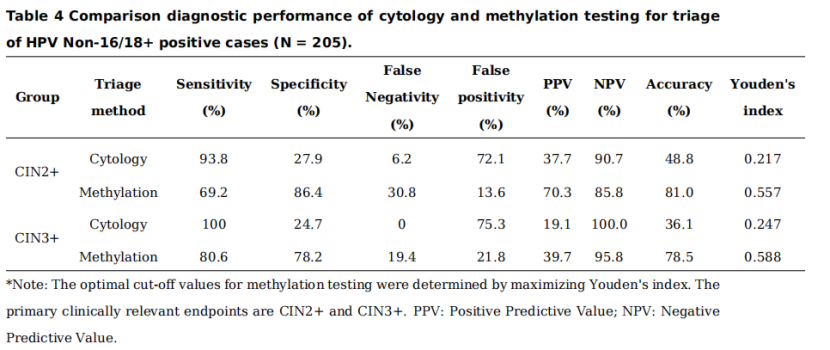

# 新文刊发 | 精准PAX1/JAM3甲基化检测作为非HPV16/18转诊阴道镜高效指标

_2026年04月10日 13:57_

近日，新疆医科大学附属肿瘤医院团队在 Clinical Epigenetics 发表研究，系统评估了 PAX1/JAM3 基因甲基化联合检测在宫颈癌前病变早期诊断中的应用价值。研究显示,该检测对 CIN2+ 和 CIN3+ 具有较高诊断效能, 尤其在 HPV non-16/18 阳性人群分流中,能够在保证高级别病变检出率的同时大幅减少不必要的阴道镜转诊，展现出良好的临床转化潜力与推广前景。

**一、研究背景与方法**

宫颈癌筛查中，细胞学检查存在主观性,HPV 检测虽敏感但特异性不足，易造成不必要的阴道镜转诊。为寻找更高效的分流工具，研究纳入 431 例宫颈脱落细胞样本，包括正常、CIN1、CIN2、CIN3 及宫颈癌患者，采用定量甲基化特异性 PCR 检测 PAX1/JAM3 甲基化水平，并结合 ROC 曲线评估其对 CIN2+、CIN3+ 的诊断效能，同时与 HPV 检测、细胞学检查比较。

**二、关键研究结果**

1\.**PAX1/JAM3 联合检测对高级别病变具有较高诊断效能**

在诊断**CIN2+**时,PAX1/JAM3 联合检测的 AUC 为**0.89**，灵敏度**83.1%**，特异度**88.8%**；在诊断**CIN3+**时,AUC 为**0.93**，灵敏度**85.7%**，特异度**87.8%**。说明该检测对宫颈高级别癌前病变具有较强区分能力

2\.**甲基化阳性率随病变严重程度明显升高**

正常、CIN1、CIN2、CIN3 和宫颈癌组的甲基化阳性率分别为**8.6%、1.9%、77.9%、95.8% 和 100%**，提示 PAX1/JAM3 甲基化水平与宫颈病变进展密切相关，可作为反映病变严重程度的分子标志物。

3\.**在非 HPV16/18 阳性人群中，甲基化检测优于细胞学分流**

对于临床最需要精细化管理的**non-16/18 hrHPV 阳性**女性，细胞学虽灵敏度高，但特异度低；PAX1/JAM3 甲基化检测在**CIN2+**分流中实现**69.2% 灵敏度、86.4% 特异度**，在**CIN3+**分流中实现**80.6% 灵敏度、78.2% 特异度**，整体平衡性更好,Youden 指数明显高于细胞学。

**4\. 甲基化检测作为 HPV non-16/18 阳性阴道镜转诊依据**

在 HPV non-16/18 阳性人群，以甲基化阳性作为转诊依据，可将阴道镜转诊率从 70.5% 降至 15.1%,同时对 CIN2+ 保持 100% 检出率，特异度由 33.6% 提高至 96.9%。这一结果是全文最具临床转化价值的发现之一。

**三、临床价值**

这项研究最突出的临床价值，在于证明了**PAX1/JAM3 甲基化检测不仅能“检出病变”，还能“优化分流”**。对于 HPV 阳性尤其是 non-16/18 高危型感染者，甲基化检测有望作为细胞学之外、甚至优于细胞学的客观分子分流工具，一方面提升高级别病变识别效率，另一方面显著减少不必要的阴道镜检查、过度转诊和患者焦虑，同时节约医疗资源。其“高特异度 \+ 高阴性预测价值”的特点，使其非常适合嵌入现有“HPV 初筛 — 分流 — 转诊”路径中。

**四、结论**

总体来看，**PAX1/JAM3 基因甲基化联合检测在宫颈高级别癌前病变早期识别中表现出优异的诊断能力，并在 HPV 阳性人群分流管理中展现出显著应用前景**。它有望成为传统 HPV 检测和细胞学检查的重要补充，尤其适用于 non-16/18 hrHPV 阳性人群的精准分流，帮助临床在保证病变检出率的同时减少不必要干预。未来，随着多中心前瞻性研究和卫生经济学评价的进一步开展，PAX1/JAM3 甲基化检测有望加速走向规范化、临床化应用。

**参考文献：**

Fan G, Xiaolu Y, Keremu Y, Weina K, Xiaohui X, Xiumin M. Effectiveness analysis and clinical application potential exploration of combined detection of PAX1/JAM3 gene methylation in early diagnosis of cervical precancerous lesions. Clin Epigenetics. Published online March 17, 2026.doi:10.1186/s13148-026-02095-z

**关于聚禾生物**

北京起源聚禾生物科技有限公司是以创新科技为驱动、以关注健康为宗旨的科技企业。聚禾生物是妇科肿瘤早诊领域的开拓者，以独家技术和专利保护的标志物为核心，开发了宫颈癌、子宫内膜癌、卵巢癌等妇科肿瘤早诊产品，填补了该领域的空白。

随着女性对自身健康的关注越来越密切，女性健康市场将大有可为，除妇科肿瘤早筛早诊产品线外，未来聚禾生物还将建立更多女性健康相关的产品管线，打造女性健康市场的技术创新型领先企业。
