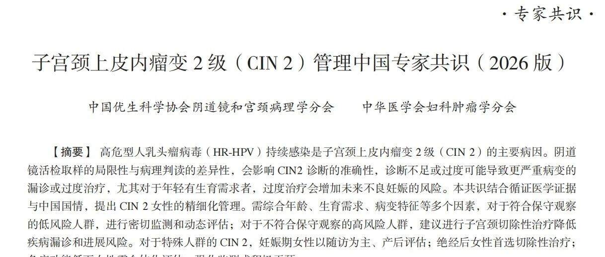
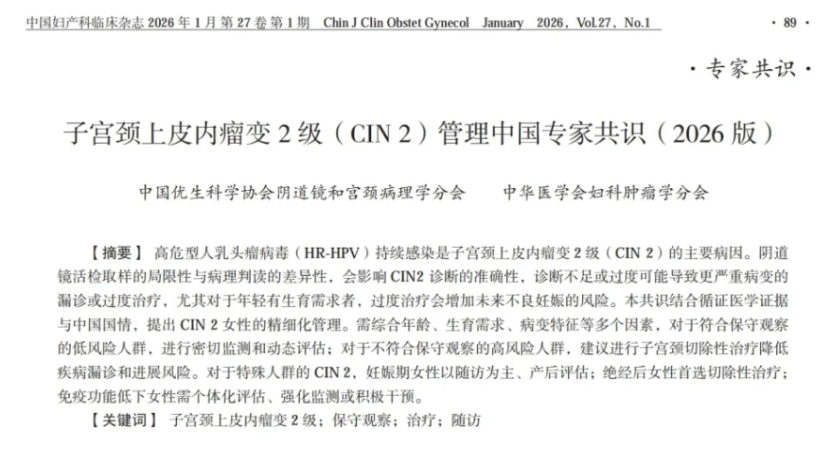

# 专家共识 | 中国发布最新CIN2管理专家共识解读，首次强调“基因甲基化检测”为精准管理依据，开启宫颈癌前病变管理新纪元

_2026年04月20日 14:52_

备受妇产科学界瞩目由中国优生科学协会阴道镜和宫颈病理学分会（CSCCP）发布的《子宫颈上皮内瘤变 2 级（CIN2）管理中国专家共识（2026 版）》（以下简称“共识”）正式发布。近十年来多项研究显示,CIN2 在 24 个月内自然消退率高，尤其 30 岁以下女性，发展为浸润癌的风险低于 0.5 ％,但更长期保守观察 CIN2 女性自然进展为浸润癌的风险再次升高，故在 CIN2 女性的处理中，如何做到精准化管理，特别是选择保守观察和治疗的适应症、监测和随访决策，以及特殊人群 CIN2 的管理，是临床亟需解决的问题。

**一、打破传统：推动临床CIN2管理从“一刀切”到“精准管理”**

传统上对活检确诊的 CIN2 多直接进行切除手术。然而，大量证据表明，尤其对于 30 岁以下女性,CIN2 病灶进展为癌的风险极低（<0.5%）。盲目“一刀切”的手术尤其是有生育需求的年轻女性造成不必要的宫颈损伤，也是一种医疗资源的浪费。

**阴道镜活检病理学确诊的 CIN2 女性，应精准区分两类人群**

- 高风险人群 (CIN3+ 漏诊或 CIN2 持续、进展为 CIN3+ 风险较高者 ),可通过子宫颈切除性治疗明确诊断并从治疗中获益 ｡

- 低风险人群 ( 以上风险较低者 ),可采用保守观察策略、通过密切监测和动态评估，最大限度避免立即有创治疗。这些评估因素包括 : 患者年龄、生育需求、子宫颈细胞学、HPV 型别、阴道镜下 SCJ 可见性、病变特征，以及患者自身免疫功能状态等。

**推荐意见 :**

1\.**<25 岁 CIN2 女性 : 优先推荐保守观察，治疗也是可接受的选择 ;**

2\.**≥25 岁有生育需求女性 ( 对切除性治疗可能影响未来妊娠的顾虑超过对疾病本身的担忧 )，如 SCJ 及病变上界可见、子宫颈管无 CIN2，既往无子宫颈病变治疗史，且满足随访观察条件者，可选择保守观察 ;**

3\.**对于病变面积大 ( 累及象限 >2 个 )、扩张性 CIN、HPV16/18 持续阳性、细胞学高度异常 [ASC-H、不典型腺细胞 (atypica- glandular cell, AGC)、HSIL]，病变持续 / 进展风险高者，保守观察应慎重。**

**二、**突破性进展：**甲基化检测成为保守观察&精准分流的“决策利器”**

研究显示特定甲基化阴性者临床消退率显着高于阳性者，**首次将宿主细胞基因甲基化检测的提升作为关键决策依据。**

研究显示基因甲基化是细胞癌变过程中的一个早期分子事件。当与宫颈癌变相关的基因发生高度甲基化时，提示细胞增殖失控，病变正在向高级别进展且自我消退可能性低。

专家共识提示目前均处于临床研究阶段，尚需要更多大样本资料证实。将甲激化列入 CIN2 专家共识，将有助于未来临床对于保守治疗的实施，并对生育力保护具重要意义 ｡

未来在临床实践中可对于 CIN2 欲进行保守治疗女性以甲基化进行管理如下

- **对于甲基化检测阴性的 CIN2 患者**：这部分患者可以被划分为“低风险人群”，从而获得更充分的信心进行为期 6-24 个月的严密保守观察，有效避免过度治疗。

- **对于甲基化检测阳性的 CIN2 患者**：这意味着病变具有较高的进展风险。共识建议将这部分患者划分为“高风险人群”,应积极建议进行切除性治疗，从而及时阻断癌变途径，避免在观察中出现病情进展。

**三、**深远影响：**优化医疗资源，提升患者生活质量**

此次共识的更新，对临床实践具有深远意义：

1\.**对于患者**：实现了最大化收益和最小化损伤。低风险患者避免了不必要的手术及其对宫颈机能、未来妊娠的潜在影响；高风险患者则能得到更及时、有效的干预。

2\.**对于医生**：提供了一个客观、量化的强大工具，解决了长期困扰临床的“治与不治”的决策难题，使诊疗决策有据可依。

3\.**对于医疗系统**：通过精准分流，将宝贵的医疗资源更集中于真正的高风险人群，提升了卫生经济学的效益。

**出处：**

中国妇产科临床杂志 , 2026, 27(01): 89-96. 

**编者注**：本文是对专家共识中关于“基因甲基化检测”要点的解读与延伸，旨在探讨其临床意义。所有医疗实践请务必以官方发布的共识全文为最终依据。

**关于聚禾生物**

北京起源聚禾生物科技有限公司是以创新科技为驱动、以关注健康为宗旨的科技企业。聚禾生物是妇科肿瘤早诊领域的开拓者，以独家技术和专利保护的标志物为核心，开发了宫颈癌、子宫内膜癌、卵巢癌等妇科肿瘤早诊产品，填补了该领域的空白。

随着女性对自身健康的关注越来越密切，女性健康市场将大有可为，除妇科肿瘤早筛早诊产品线外，未来聚禾生物还将建立更多女性健康相关的产品管线，打造女性健康市场的技术创新型领先企业。
