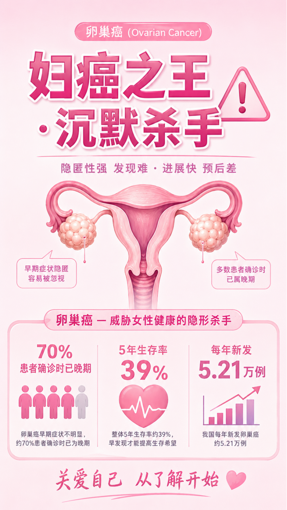

# 世界卵巢癌日：聚禾生物以甲基化技术助力更早发现“沉默杀手”

_2026年05月08日 09:50_

5 月 8 日是世界卵巢癌日。卵巢癌被称为 " 妇癌之王 ",因其早期症状隐匿，约 70% 的患者确诊时已进入中晚期，五年生存率不足 50%。早期发现成为对抗这一疾病的关键。

**一、关注身体信号，及时发现风险**

卵巢位于盆腔深处，早期病变不易察觉。以下症状需特别警惕：持续腹胀腹痛、食欲下降腹围增大、尿频尿急、排便习惯改变、不明原因乏力或体重减轻。

这些症状虽不一定是卵巢癌，但若持续存在，应引起重视。卵巢癌防治的核心难题在于：如何在症状不明显时更早识别风险。

**二、甲基化检测提供早筛新路径**

获国家药监局三类械证的无创卵巢癌 CDO1/HOXA9 甲基化检测，通过捕捉血液中的特异性甲基化信号实现早期“分子预见”，为女性提供无创便捷的筛查选择。

**三、早发现为健康护航**

世界卵巢癌日提醒我们，关注卵巢癌不仅是关注一种疾病，更是关注每一位女性的长期健康。随着分子检测技术发展，卵巢癌早期诊断正迎来突破。

聚禾甲基化检测通过科技力量为女性健康筑起防线，让 " 沉默 " 的卵巢癌风险被更早看见。

温馨提示：本文为疾病科普内容，不能替代医生诊断与治疗建议。如出现持续腹胀、腹痛、食欲下降、尿频尿急等异常症状，请及时前往正规医疗机构就诊。

**关于聚禾生物**

北京起源聚禾生物科技有限公司是以创新科技为驱动、以关注健康为宗旨的科技企业。聚禾生物是妇科肿瘤早诊领域的开拓者，以独家技术和专利保护的标志物为核心，开发了宫颈癌、子宫内膜癌、卵巢癌等妇科肿瘤早诊产品，填补了该领域的空白。

随着女性对自身健康的关注越来越密切，女性健康市场将大有可为，除妇科肿瘤早筛早诊产品线外，未来聚禾生物还将建立更多女性健康相关的产品管线，打造女性健康市场的技术创新型领先企业。
