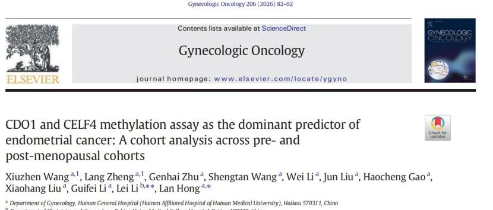

# 新文刊发 | 革新子宫内膜癌早期筛查：无创禾蔻安®（CDO1/CELF4）检测为高风险女性提供精准筛查方案

_2026年05月13日 14:34_

近日，一项发表于《Gynecologic Oncology》由海南省人民医院和北京协和医院共同完成的研究揭示，基于宫颈刮取细胞的禾蔻安 ®（CDO1/CELF4）甲基化检测，在绝经前与绝经后风险女性中均表现出稳定且优异的筛查性能。该检测作为子宫内膜癌的强独立预测因子，其无创特性与整体诊断效能超越传统超声内膜厚度测量及其他常规临床指标，为风险女性的筛查管理开辟了新途径。

**一、研究背景**

全球范围内子宫内膜癌发病率持续上升，且患者呈现年轻化趋势。早期发现至关重要：早期患者 5 年生存率可超过 90%,而晚期则骤降至约 17%。

目前常用的经阴道超声检查依赖子宫内膜厚度测量，但在绝经前女性中缺乏统一判断标准，对绝经后女性又可能引发过度检查。此外，诊断性刮宫或宫腔镜活检虽为诊断“金标准”,但属于有创操作，可能带来疼痛、出血、感染风险，甚至对子宫内膜造成损伤，影响生育功能，使得部分女性望而却步，可能导致诊断延迟。

禾蔻安 ® 作为基于宫颈脱落细胞样本的无创子宫内膜癌检测工具，能够通过无创采样实现高精准度检测，为风险人群的早期筛查提供了新选择。

**二、研究方法**

该前瞻性队列研究纳入了具有子宫内膜癌风险的绝经前与绝经后女性，直接比较了宫颈细胞 CDO1/CELF4 甲基化检测与传统超声测量内膜厚度的诊断表现。

**三、核心发现**

- 高诊断效能：禾蔻安 ® 检测在绝经前与绝经后人群中均保持 AUC>0.90 的出色表现，显著优于传统超声内膜厚度测量。

- 独立预测价值：多因素分析校正后，禾蔻安 ® 检测是子宫内膜癌的最强预测指标（绝经前 OR=103.9,绝经后 OR=118.0），预测能力优于年龄、异常出血等临床因素。

- 灵活的联合筛查策略：禾蔻安 ® 检测与超声联合应用可提高筛查效率。两者任一阳性时灵敏度高（绝经前 96.6%,绝经后 100%）；两者同时阳性时特异性可达近 98%,有助于精准识别高风险人群。

**四、禾蔻安®检测主要筛查人群和临床意义**

- · 患有代谢性疾病者：如肥胖、高血压、糖尿病，这三者常被称为“子宫内膜癌三联征”。

- · 有特定病史或家族史者：包括多囊卵巢综合征、不孕症患者，有子宫内膜癌、卵巢癌或林奇综合征等家族史的女性，以及长期接受无孕激素拮抗的雌激素治疗或他莫昔芬治疗的女性。

- · 存在异常症状者：如异常子宫出血（尤其是绝经后出血）、月经紊乱。

- · 遗传高危人群：如 Lynch 综合征女性，建议从 30-35 岁或更早（基于家族发病年龄）开始定期筛查。

- · 健康关注与主动管理者：关注子宫内膜健康，希望借助高灵敏度、无创技术进行早期风险筛查的女性。

禾蔻安 ® 检测采用与 HPV 检测相似的无创采样方式，操作简便,几分钟即可完成,易于在门诊开展，能显著提升女性的受检意愿和筛查可及性。这种无创性有助解决因传统方法局限或恐惧有创操作导致的诊断延迟问题。

**五、总结**

禾蔻安 ® 甲基化检测作为子宫内膜癌风险人群筛查的有效工具，能弥补传统超声检查的局限性，为高风险女性提供无创、精准的筛查新路径。其高灵敏度和特异性有助于早期发现病变，显著改善患者预后，为子宫内膜癌的早期筛查与风险分层提供了重要的新技术手段。

**参考文献**

Wang X, Zheng L, Zhu G, Wang S, Li W, Liu J, Gao H, Liu X, Li G, Li L, Hong L.CDO1 and CELF4 methylation assay as the dominant predictor of endometrial cancer: A cohort analysis across pre- and post-menopausal cohorts. Gynecol Oncol. 2026 Feb 14;206:82-92. doi: 10.1016/j.ygyno.2026.01.776

**关于聚禾生物**

北京起源聚禾生物科技有限公司是以创新科技为驱动、以关注健康为宗旨的科技企业。聚禾生物是妇科肿瘤早诊领域的开拓者，以独家技术和专利保护的标志物为核心，开发了宫颈癌、子宫内膜癌、卵巢癌等妇科肿瘤早诊产品，填补了该领域的空白。

随着女性对自身健康的关注越来越密切，女性健康市场将大有可为，除妇科肿瘤早筛早诊产品线外，未来聚禾生物还将建立更多女性健康相关的产品管线，打造女性健康市场的技术创新型领先企业。
