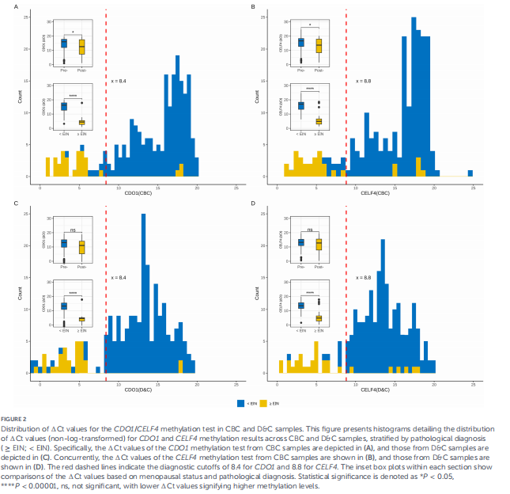
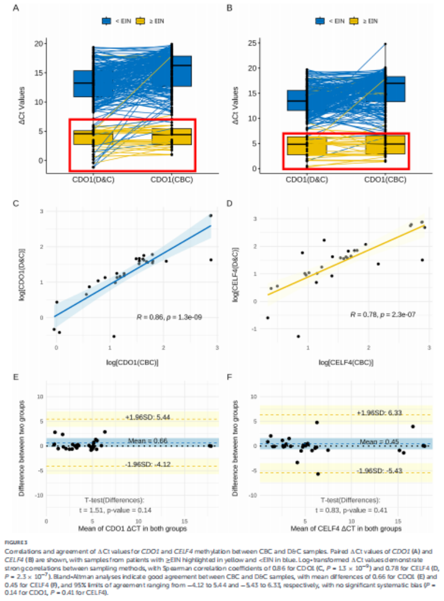

# 新文刊发 | 无创检测助力子宫内膜癌早诊：宫颈CDO1/CELF4甲基化检测获前瞻性验证

_2026年06月02日 15:54_

近日，甘肃省妇幼保健院团队在《Frontiers in Medicine》发表题为《Validation of a cervical CDO1/CELF4 methylation test for endometrial cancer: a prospective paired-sample comparison with intrauterine specimen》的研究。该研究证实，基于宫颈刷取样本的 CDO1/CELF4 甲基化检测可高效识别子宫内膜上皮内瘤变（EIN）及子宫内膜癌（EC），其诊断效能与宫腔诊刮样本相比无显著差异，为子宫内膜癌早期发现提供了更便捷、低创的分流方案。

**一、研究背景与方法**

子宫内膜癌发病率持续上升，早诊早治对改善预后至关重要。然而，传统诊断多依赖宫腔镜、诊刮及病理检查，存在侵入性强、患者不适和依从性不足等问题；经阴道超声、CA125 等无创手段又存在特异性或稳定性不足。研究团队开展前瞻性配对样本研究，纳入 226 名有宫腔检查或手术指征的女性，同次就诊中依次采集宫颈刷取细胞和宫腔诊刮样本，并检测 CDO1/CELF4 甲基化水平，以病理结果作为诊断标准进行比较。

**二、关键研究结果**

226 名受试者中,31 例被诊断为 EIN 或子宫内膜癌。结果显示，无论采用宫颈刷取样本还是诊刮样本,CDO1、CELF4 及其联合检测 CISENDO 均明显优于传统指标。宫颈样本 CISENDO 检测 AUC 达 0.916,诊刮样本 AUC 为
0.929,两者诊断效能无统计学显著差异。两类样本在 CDO1 和 CELF4 检测结果上呈高度一致，相关系数分别为 0.86 和
0.78,提示宫颈刷取样本可较好反映宫腔病变相关甲基化信号。

**三、临床价值**

该研究的核心价值在于证明：无需进入宫腔、仅通过宫颈刷取即可获得具有较高诊断价值的分子检测结果。相较于诊刮和宫腔镜，宫颈取样更简便、患者接受度更高，适合门诊操作，也有望与现有宫颈癌筛查流程结合。对于异常子宫出血、绝经后出血或其他高风险女性，该检测可作为精准分流工具，帮助医生判断是否需要进一步侵入性检查，从而减少不必要的诊刮和宫腔镜操作，同时降低漏诊风险。

**四、小结**

本研究进一步验证了 CDO1/CELF4 甲基化检测在子宫内膜癌及癌前病变识别中的可靠性，尤其证明宫颈刷取样本与宫腔诊刮样本具有相近诊断表现。研究结果支持将宫颈甲基化检测作为子宫内膜癌早期发现和临床分流的重要补充手段。未来仍需多中心、大样本研究进一步验证其在更广泛人群中的适用性和卫生经济学价值。

**参考文献：**

Cai B, Wang Y, Ma W, Wu Z, Yao T, Liu P,Wang L, Zhou P and Li Y (2026) Validation of a cervical CDO1/CELF4methylation test for endometrialcancer: a prospective paired-samplecomparison with intrauterine specimen.Front. Med.13:1690020. doi: 10.3389/fmed.2026.1690020

**关于聚禾生物**

北京起源聚禾生物科技有限公司是以创新科技为驱动、以关注健康为宗旨的科技企业。聚禾生物是妇科肿瘤早诊领域的开拓者，以独家技术和专利保护的标志物为核心，开发了宫颈癌、子宫内膜癌、卵巢癌等妇科肿瘤早诊产品，填补了该领域的空白。

随着女性对自身健康的关注越来越密切，女性健康市场将大有可为，除妇科肿瘤早筛早诊产品线外，未来聚禾生物还将建立更多女性健康相关的产品管线，打造女性健康市场的技术创新型领先企业。
