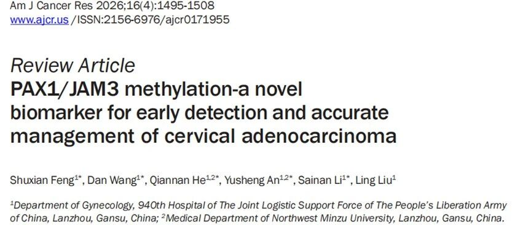
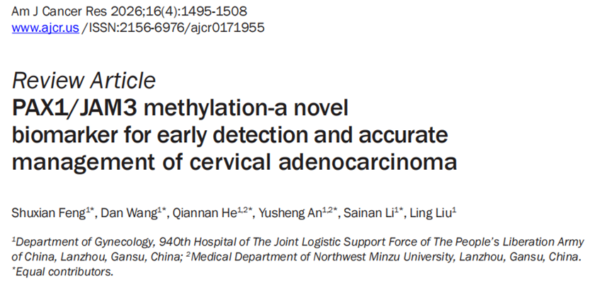
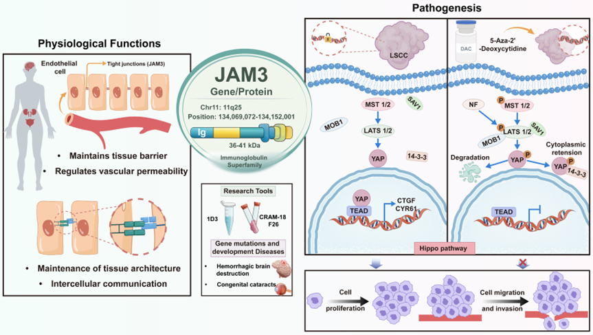

# 新文刊发 | PAX1/JAM3双基因甲基化为宫颈腺癌防治提供精准新思路

_2026年06月16日 16:24_

近日，综述文章《PAX1/JAM3 methylation-a novel biomarker for early detection and accurate management of cervical adenocarcinoma》系统总结了 PAX1/JAM3 双基因甲基化在宫颈腺癌早期识别和精准管理中的研究进展。文章指出，宫颈腺癌病灶位置隐匿，传统细胞学筛查敏感性有限，高危 HPV 检测虽敏感但特异性不足，部分病例还可能出现 HPV 阴性，增加漏诊风险。

**一、本土力量推动临床进展**

作为技术核心推动者，聚禾生物与全国多家临床中心深度合作。自其核心产品禾宫康 ( CISCER) 获 NMPA 批准上市后，累积了大量真实世界数据，相关成果频频亮相国际学术会议。本篇综述正是基于这些扎实的循证医学证据，确认了该技术从科研走向临床的关键路径。

**二、机制解密：「一守一攻」阻断癌变**

**研究指出，双基因甲基化从两个维度精准捕捉癌变信号：**

PAX1（内部失守）：抑癌基因沉默，释放 Wnt/EGF 等促癌信号，导致细胞疯狂增生。

JAM3（外部失控）：细胞黏附能力下降，激活侵袭通路，加速肿瘤转移与扩散。

**三、临床革新：精准分流，拒绝「一刀切」**

相较于单一指标，双基因甲基化联检能有效填补现有细胞学和 HPV 筛查空白：

精准分流：在 HPV 阳性人群中，精准区分「只是 HPV 感染」和「真正高级别病变」，减少约 30% 非必要阴道镜检查。

查漏补缺：显著提升对隐匿性宫颈腺癌的侦测率，解决现在越来越多宫颈腺癌发生率与传统筛查「漏检」难题。

全程管理：术后持续追踪甲基化水平，可作为复发风险预警的「分子哨兵」。

**四、结语**

随着多中心数据的不断验证,PAX1/JAM3 双基因甲基化检测有望成为宫颈癌筛查策略中的重要拼图，推动临床从「经验医学」迈向「精准医学」。

**参考来源**

Feng S, Wang D, He Q, An Y, Li S, Liu L. PAX1/JAM3 methylation-a novel biomarker for early detection and accurate management of cervical adenocarcinoma. Am J Cancer Res. 2026;16(4):1495-1508. doi:10.62347/SATU5579

**关于聚禾生物**

北京起源聚禾生物科技有限公司是以创新科技为驱动、以关注健康为宗旨的科技企业。聚禾生物是妇科肿瘤早诊领域的开拓者，以独家技术和专利保护的标志物为核心，开发了宫颈癌、子宫内膜癌、卵巢癌等妇科肿瘤早诊产品，填补了该领域的空白。

随着女性对自身健康的关注越来越密切，女性健康市场将大有可为，除妇科肿瘤早筛早诊产品线外，未来聚禾生物还将建立更多女性健康相关的产品管线，打造女性健康市场的技术创新型领先企业。
