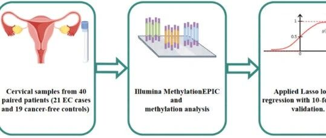
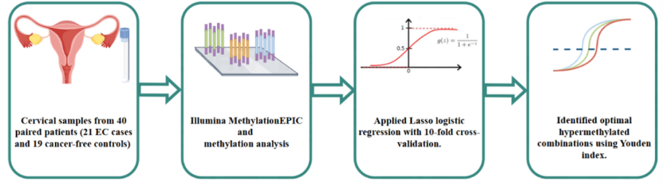

# 新文刊发 | 宫颈细胞学CDO1/CELF4甲基化基因发现破解子宫内膜癌「看不准、检查痛」困境

_2026年07月02日 10:50_

子宫内膜癌发生率逐年攀升，但临床诊断常面临「影像学看不准、活检太痛苦」的两难。近日，北京协和医院团队，于国际权威期刊《Frontiers in Oncology》发表名为 **《Development and validation of hypermethylated gene markers in cervical cytological samples for detecting endometrial cancer (EndoMethy-I trial)》** 的原创研究。

该研究成功挖掘内膜癌特异性基因并验证了基于宫颈细胞采样的**CDO1/CELF4 基因甲基化检测**。这项技术只需透过类似抹片的采样方式，就能精准捕捉癌变信号，将子宫内膜癌的筛查从「侵入性手术」推向「分子级诊断」。

**一、数据亮眼：敏感度突破九成**

研究显示,CDO1 和 CELF4 是表现最突出的高甲基化标志物。在训练集中，二者检测子宫内膜癌的 AUC（曲线下面积）分别达到
0.93**和**0.91**，显示出极强的判别能力。在验证组中,CDO1/CELF4 双基因联合检测的**敏感度达
92.34%,特异性达 89.2%。相较之下，单纯依赖子宫内膜厚度或 CA125,常有假阳性过高或漏诊的风险。

EndoMethy-I 研究不仅证实了宫颈细胞甲基化检测的安全性与有效性，更透过**「超音波看形态，甲基化看分子」** 的互补策略，为子宫内膜癌的早期发现提供了全新的无创精准工具。未来，随着更大规模的临床推广，这将成为女性健康防护网中不可或缺的一环。

**图 1\. 宫颈脱落细胞 CDO1/CELF4 甲基化检测内膜癌的基因挖掘流程**

**二、研究在临床启发**

基于 EndoMethy-I 的研究成果，**「超音波看形态，甲基化看分子，互补不漏诊」**已成为最新可行性的临床应用。「双轨制」流程可优化现行诊疗程序：

1\.**门诊初筛（形态 \+ 分子）：**

当患者主诉异常出血时，建议同步进行「经阴道超音波（看形态）」与「甲基化检测（看分子）」。

- **双阳性（超音波异常 \+ 甲基化阳性）：**高度怀疑恶性，应立即安排侵入性检查。

- **形态正常但分子阳性：**警惕「隐匿性」病变，不应因超音波正常而掉以轻心，建议积极随访或进一步检查。

- **双阴性：**可安全回归常规追踪，大幅降低症状人群内膜癌焦虑。

2\.**灰色地带的决策支持：**

针对内膜厚度介于手术临界值（如 4-8mm）的停经后妇女，或非典型超声结果的有症状女性，甲基化检测可提供关键的「分子证据」。阳性者转介专科进一步检查,阴性者则可降低不必要的侵入性检查次数。

**三、** 小结

EndoMethy-I 研究不仅证实了宫颈细胞甲基化检测的安全性与有效性，更透过**「超音波看形态，甲基化看分子」** 的互补策略，为子宫内膜癌的早期发现提供了全新的无创精准工具。未来，随着更大规模的临床研究数据验证和推广，这将成为女性健康防护网中不可或缺的一环。

**参考文献**

Chen X, Liu L, Jin X, Cheng Y, Wu H You Y, Liou Y, Liu P, Lang J and Li (2026) Development and validation of hypemethylated gene marker i cervical cytological samples for detecting endometrial cancer(EndoMethy-I trial)Front Oncol. 16:1849730.doi: 10.3389/fonc.2026.1849730

**关于聚禾生物**

北京起源聚禾生物科技有限公司是以创新科技为驱动、以关注健康为宗旨的科技企业。聚禾生物是妇科肿瘤早诊领域的开拓者，以独家技术和专利保护的标志物为核心，开发了宫颈癌、子宫内膜癌、卵巢癌等妇科肿瘤早诊产品，填补了该领域的空白。

随着女性对自身健康的关注越来越密切，女性健康市场将大有可为，除妇科肿瘤早筛早诊产品线外，未来聚禾生物还将建立更多女性健康相关的产品管线，打造女性健康市场的技术创新型领先企业。
