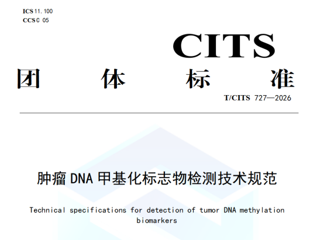

# 聚禾生物妇科三癌甲基化检测全线进入《肿瘤DNA甲基化标志物检测技术规范》团体标准

_2026年07月14日 15:01_

中国检验检测学会正式发布并实施团体标准**T/CITS 727—2026《肿瘤 DNA 甲基化标志物检测技术规范》**（以下简称「团标」）。北京起源聚禾生物科技有限公司（以下简称「聚禾生物」）旗下**子宫颈癌、子宫内膜癌、卵巢癌**三大妇科肿瘤 DNA 甲基化检测产品，全部被列入团标附录 A「目前获批的肿瘤 DNA 甲基化标志物检测列表」，成为少数实现妇科三大癌种甲基化检测全覆盖、且与国家团标对齐的创新企业。

**📌 团标发布：甲基化检测从「百花齐放」走向「有规可依」**

T/CITS 727—2026 由**中国检验检测学会**归口，联合**吉林大学第一医院、中国医学科学院肿瘤医院、中国医学科学院北京协和医院、天津市肿瘤医院、哈尔滨医科大学附属肿瘤医院、陆军军医大学第一附属医院、湖北省肿瘤医院**等十六家机构共同起草，是中国首个针对肿瘤 DNA 甲基化标志物检测**全流程** 的技术规范，涵盖检测前（标本类型、采集、保存运输）、检测中（方法学选择、DNA 提取、转化、PCR/NGS/MALDI-TOF MS 操作）、检测后（报告内容、解读）及质量控制（室内质控、室间质评、性能验证）的完整死循环。

团标附录 A 以「资料性」形式列出**目前已获 NMPA 批复的甲基化检测产品列表**，被行业视为甲基化赛道的「合规白名单」参考。

**🎯 聚禾生物三大妇科产品与团标条目精准对齐**

| 癌种       | 团标附录 A 标本类型         | 团标附录 A 标志物组合       | 聚禾对应产品                                                                 | NMPA 注册证          |
| ---------- | -------------------------- | -------------------------- | -------------------------------------------------------------------------- | -------------------- |
| 子宫颈癌   | 宫颈刷取标本               | 双靶：PAX1/JAM3            | 禾宫康 ® CISCER®（人 PAX1 和 JAM3 基因甲基化检测试剂盒，PCR-荧光探针法）| 国械注准 20233400253 |
| 子宫内膜癌 | 宫颈刷取标本 / 宫腔刷取标本 | 双靶：CDO1/CELF4（宫颈刷） | 禾蔻安 ®（人 CDO1 和 CELF4 基因甲基化检测试剂盒）| 国械注准 20243402610 |
| 卵巢癌     | 血液                       | 双靶：CDO1/HOXA9           | 禾薇益 ®（人 CDO1 和 HOXA9 基因甲基化检测试剂盒，PCR-荧光探针法）| 国械注准 20253402443 |

**🔑 入围团目标三层意义**

**1\. 合规护城河**

团标明确了甲基化检测从标本采集（如血液抗凝血不宜用肝素、cfDNA 宜采 2–10 mL 全血）到报告解读（多基因组合需给出整体风险评分）的全链路 SOP,入围附录 A 意味着聚禾三款产品的方法学与临床定位已与国家级规范同频，为后续进院、招投标、临床沟通提供标准依据。

**2\. 妇科早诊「无创全景覆盖」的稀缺性**

目前国内甲基化获批产品集中在结直肠癌（Septin9、SDC2 等）、肺癌（SHOX2/RASSF1A）、肝癌等领域，**妇科三大癌同时有对应获批产品且进入同一份团目标企业，聚禾是目前为止最具代表性的案例**—— 子宫颈（分流）\+ 子宫内膜（早筛）\+ 卵巢（辅助诊断）形成互补组合，可支撑妇科门诊「一站式甲基化评估」的临床路径。

**3\. 从「单点创新」到「行业基建」**

团标起草单位以公立三甲与省级肿瘤专科医院为主，附录 A 的「获批列表」本质上是对已上市产品的临床价值二次确认。聚禾三癌全线入围，标志其从「产品型公司」迈向「参与行业规则制定的技术方」。

**关于聚禾生物**

北京起源聚禾生物科技有限公司是以创新科技为驱动、以关注健康为宗旨的科技企业。聚禾生物是妇科肿瘤早诊领域的开拓者，以独家技术和专利保护的标志物为核心，开发了宫颈癌、子宫内膜癌、卵巢癌等妇科肿瘤早诊产品，填补了该领域的空白。

随着女性对自身健康的关注越来越密切，女性健康市场将大有可为，除妇科肿瘤早筛早诊产品线外，未来聚禾生物还将建立更多女性健康相关的产品管线，打造女性健康市场的技术创新型领先企业。
