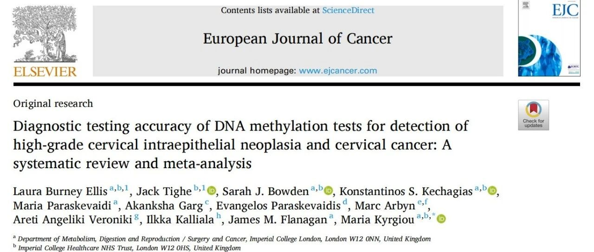

# 国际视野 | PAX1/JAM3双靶甲基化：凭何成为WHO专家眼中的“破局者”？

_2026年07月16日 10:53_

一项覆盖全球近 5 万例样本的超级 Meta 分析发表于 European Journal of Cancer，由国际专家将**PAX1/JAM3 双靶甲基化** 检测推向了国际舞台的中央。这不仅仅是一篇高分论文的发表，更是国际权威专家组对未来子宫颈癌甲基化检测和筛查路线的一次背书和“投票”。

为何 PAX1/JAM3 双靶组合能在全球 32 种竞争者中脱颖而出？我们从国际认可度与临床特色两个维度为您深度解析。

**一、国际权威的“最高认证”**

本次研究的作者名单本身就是一份“WHO/ESGO 指南专家名录”。**Marc Arbyn**教授作为 WHO 子宫颈癌指南的“掌舵人”,其亲自参与的研究结论往往直接决定未来数年临床指南的走向。本次研究明确指出,PAX1/JAM3 双靶组合在全人群 CIN2+ 检测中的诊断比值比（DOR）达到了惊人的**76.00**，这是目前国际公开发表的循证医学证据中的最高纪录之一。

这一数据的含金量在于，它意味着 PAX1/JAM3 获得了**“指南级”的循证背书,把 PAX1和JAM3 列为全球证据最强的宫颈甲基化标志物。**对于临床医生而言，这不仅仅是实验室数据的胜利，更是对接未来国际诊疗规范的通行证。它呼应了**ESGO 2025 年 CIN2 主动监测共识**中关于寻找更精准生物标志物的迫切需求。

**二、**破解临床痛点的“三大特色”

相较于传统的细胞学检查及单一 HPV 检测,PAX1/JAM3 双靶甲基化在临床应用上展现了显著的优势：

**1\. 突破 HPV 限制的“广谱侦测力”**

目前的临床困境在于,HPV 检测灵敏度高但特异度低，导致大量一过性感染者面临过度转诊。本研究证实,PAX1/JAM3 双靶检测在**“不限定 HPV 状态”**的全人群中都表现出色（DOR=76.00）。这意味着它不再仅仅是 HPV 阳性的“附属品”,而是能够直接反映宫颈病变进展的独立分子标志物。这种特性使得它在 HPV 初筛阴性但仍存在病变风险的病例中，具有极高的漏诊补救价值。

**2\. 解决“阴道镜过载”的精准分流器**

在 HPV 阳性人群中,JAM3 与 PAX1 展现了优异的特异度（分别为 88% 和 87%）。结合两者优势的双靶检测，能够像一把精准的手术刀，从庞大的 HPV 阳性人群中筛选出真正需要干预的患者。**这直接解决了全球范围内“阴道镜资源紧张”和“过度医疗”的痛点**，让有限的医疗资源集中在最高风险的人群身上。

**3\. 克服异质性的“双保险”机制**

肿瘤的发生发展是一个多基因参与的复杂过程。本研究特别指出，双靶策略可有效降低单一基因甲基化异质性带来的检测波动。PAX1 与 JAM3 在致癌通路中扮演不同角色，双靶联合不仅提高了检测的稳健性，更大幅降低了因单一靶点变异导致的假阴性风险，为临床决策提供了更为可靠的分子依据。

**三、**小结

随着 WHO 加速消除宫颈癌战略的推进，寻找高效、稳定、可普及的生物标志物已成全球共识。PAX1/JAM3 双靶甲基化凭借其顶级的循证医学证据和国际指南专家的高度认可，正逐步确立其在宫颈癌精准筛查领域的核心地位，有望成为改变未来临床实践的关键力量。

**Diagnostic testing accuracy of DNA methylation tests for detection of high-grade cervical intraepithelial neoplasia and cervical cancer: A systematic review and meta-analysis.**European Journal of Cancer, 2026; 243

**关于聚禾生物**

北京起源聚禾生物科技有限公司是以创新科技为驱动、以关注健康为宗旨的科技企业。聚禾生物是妇科肿瘤早诊领域的开拓者，以独家技术和专利保护的标志物为核心，开发了宫颈癌、子宫内膜癌、卵巢癌等妇科肿瘤早诊产品，填补了该领域的空白。

随着女性对自身健康的关注越来越密切，女性健康市场将大有可为，除妇科肿瘤早筛早诊产品线外，未来聚禾生物还将建立更多女性健康相关的产品管线，打造女性健康市场的技术创新型领先企业。
