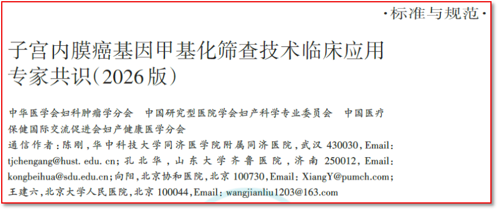

# 指南/共识全球首部子宫内膜癌甲基化临床应用专家共识发布，聚禾生物禾蔻安®解决“金标准”依从性难题【系列报道一】

_2026年07月22日 15:30_

由中华医学会妇科肿瘤学分会、中国研究型医院学会妇产科学专业委员会、中国医疗保健国际交流促进会妇产健康医学分会联合牵头，汇聚北京协和医院、北京大学人民医院、山东大学齐鲁医院、华中科技大学同济医学院附属同济医院、四川大学华西第二医院等国内顶尖妇瘤中心权威专家共同撰写的《子宫内膜癌基因甲基化筛查技术临床应用专家共识（2026 版）》（以下简称“共识”）于《中华医学杂志》正式发布。

这是全球首部针对子宫内膜癌基因甲基化筛查技术临床应用的专家共识，标志着子宫内膜癌防控正式迈入「**微无创、精准化、个体化**」的早筛时代。值得注意的是，在此次共识发布前,北京起源聚禾生物科技有限公司自主研发的“人 CDO1 和 CELF4 基因甲基化检测试剂盒（禾蔻安 ®）”已于 2024 年 12 月率先获得国家药品监督管理局（NMPA）第三类医疗器械注册证（国械注准 20243402610），成为国内首批获准上市的子宫内膜癌甲基化检测产品，为共识推荐的“选择性筛查”策略提供了合规且高效的工具。

**一、开创性意义：填补国际空白，确立“选择性筛查”路径**

子宫内膜癌是全球发病率持续上升且呈现年轻化趋势的妇科恶性肿瘤。根据《中国妇科肿瘤临床实践指南》，临床需针对「**有症状人群、风险增加人群、高风险人群**」三类群体开展筛查。

共识指出：“2025 年,子宫内膜癌基因甲基化检测技术已正式通过国家药品监督管理局批准上市并应用于临床，作为一项新的分子检测手段，该技术可及时发现早期子宫内膜癌风险,有效填补了该领域「**临床无创筛查**」的技术空白”。此次共识的发布，正是为了规范甲基化检测技术在三类人群中的应用流程，实现精准分流，改善患者预后。

**二、传统筛查困境：金标准的「创伤」与超声的「误伤」**

共识系统性地梳理了现有筛查技术的痛点，凸显了引入新技术的紧迫性：

(一) **病理金标准的局限：** “目前，临床上推荐 **宫腔镜下定位活检** 或 **宫腔镜联合分段诊刮** 子宫内膜组织病理检查作为诊断子宫内膜癌的「金标准」”_。然而,_“诊断性刮宫可能造成 60% 的子宫内膜病变漏诊。此外，该方法为有创操作，短时间内可重复性差，并有导致子宫穿孔、出血、感染和周围脏器损伤等风险,不适合作为常规筛查手段”。

(二) **微组织采样的挑战：** 尽管子宫内膜微组织病理检查具有微创、无需麻醉等优点，但“如何提高采样满意率，特别是对于绝经后或子宫内膜厚度不足的患者，是亟待解决的难题”。

(三) **超声的高漏诊风险：** “超声检查虽灵敏度高，但存在特异度低、阳性预测值较低和假阳性率较高等问题。因此，超声检查主要用于绝经后女性子宫内膜癌的初步筛查,而非单独筛查的首要方法”。

**三、聚禾生物禾蔻安®：以优异性能承接临床无创检测重任**

针对上述临床痛点，共识明确指出：“目前，可用于临床开展内膜癌筛查的技术主要包括超声检查、病理检查和基因甲基化检测技术”。

禾蔻安 ®（人 CDO1 和 CELF4 基因甲基化检测试剂盒）凭借其卓越性能，成为共识推荐的重要技术手段。据产品临床试验数据,禾蔻安 ® 检测临床灵敏度达 94.51%、特异度达 94.16%。该产品采用宫颈脱落细胞采样，与常规 HPV 检测采样路径完全一致，实现了专家共识指出真正的无创检测。

共识专家特别强调：“在临床应用上,甲基化检测可结合临床最常用的超声检查方法,对有症状人群、风险增加人群、高风险人群进行精准管理, 减少过多宫腔操作所带来的内膜损伤和患者的经济负担”。作为 2024 年国内首个（首批）获证的相关产品，禾蔻安 ® 将在这一临床路径中承担起关键的无创筛查与分流任务。

**四、共识核心：甲基化技术的四大临床优势**

综合共识内容，基因甲基化检测技术（以获得 NMPA 核准的禾蔻安 ® 为代表）相较于传统手段具有以下显著优点：

1. 微无创采样，依从性高：利用宫颈刷采集脱落细胞,无需扩宫、无需麻醉，极大降低了患者痛苦，解决了传统诊刮和宫腔镜患者依从性差的问题。

2. 精准分流，避免“过度诊疗”：高特异度（94.16%）有效降低了超声假阳性带来的不必要有创手术；高灵敏度（94.51%）确保了高风险人群的检出率。

3. 适用人群广，尤其适合“难采样”人群：对于绝经后内膜变薄、宫颈管狭窄等传统采样困难的患者，宫颈脱落细胞采样具有独特优势。

4. 助力“选择性筛查”落地：为《中国妇科肿瘤临床实践指南》推荐的三类高危人群提供了切实可行的筛查工具，是实现子宫内膜癌早诊早治的关键一环。

随着 2026 版共识的落地,聚禾生物将携手国内各大临床中心,共同推动子宫内膜癌筛查从『有创分流』向『无创管理』的范式转变，切实保护女性生育力及生活质量。

**文献出处**

中华医学会妇科肿瘤学分会 , 中国研究型医院学会妇产科学专业委员会 , 中国医疗保健国际交流促进会妇产健康医学分会 .子宫内膜癌基因甲基化筛查技术临床应用专家共识 (2026 版 ). 中华医学杂志 ,2026,106(26)：2701-2710.DOI: 10.3760/cma.j.cn112137-20260301-00576

**关于聚禾生物**

北京起源聚禾生物科技有限公司是以创新科技为驱动、以关注健康为宗旨的科技企业。聚禾生物是妇科肿瘤早诊领域的开拓者，以独家技术和专利保护的标志物为核心，开发了宫颈癌、子宫内膜癌、卵巢癌等妇科肿瘤早诊产品，填补了该领域的空白。

随着女性对自身健康的关注越来越密切，女性健康市场将大有可为，除妇科肿瘤早筛早诊产品线外，未来聚禾生物还将建立更多女性健康相关的产品管线，打造女性健康市场的技术创新型领先企业。
